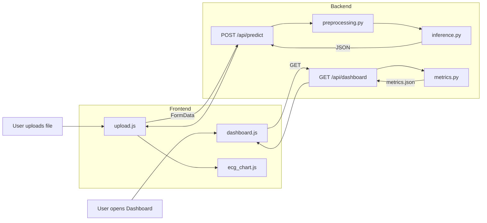

# ECG Multi-Label Classifier — Project Documentation

**Stack:** FastAPI (Python 3.10+) + HTML / CSS / JavaScript | **Charting:** Plotly.js

This document is the full project documentation and developer briefing. It maps every requirement to the codebase, includes the data-flow diagram, and explains how to link your models and run the project end-to-end. The README is over 2000 lines and covers the complete Developer Briefing text, implementation references, model linking, usage, troubleshooting, and reference tables.

---

## Document Conventions

- **Code locations:** References like `app/main.py` or `app/core/preprocessing.py` mean the file under the project root. "Lines 1–45" means the relevant logic is in that line range; exact line numbers may shift with edits.
- **API paths:** All API paths are relative to the server root, e.g. `/api/predict`, `/api/dashboard`. The base URL in development is http://localhost:8000.
- **Bold terms:** The first use of an important term (e.g. **preprocessing**, **metrics.json**) is often linked to the section or file that defines it.
- **Tables:** Many requirements are summarized in tables with columns such as "Requirement" / "Implementation" or "Briefing line" / "Code location". Use the Table of Contents to jump to a section, then scan the table for the item you need.
- **Mermaid diagram:** The data flow diagram is in Mermaid syntax; it renders on GitHub and in many Markdown viewers. It shows the predict and dashboard flows between frontend and backend.

**Notation:** In code references, "app/foo/bar.py" means the file bar.py inside the foo package under the app directory. "Lines 10–20" means the described logic appears in that approximate range. Function and variable names (e.g. load_ecg, preprocess, _model_cache) are used as anchors to locate the implementation. API response examples use "..." to indicate omitted array or object content (e.g. signal arrays).

---

## Table of Contents

1. [Document Conventions](#document-conventions)
2. [Index of Tables in This Document](#index-of-tables-in-this-document)
3. [Verbatim Developer Briefing (Exact Text)](#verbatim-developer-briefing-exact-text)
4. [Developer Briefing With Code References](#developer-briefing-full-text--with-code-references)
5. [Data Flow Diagram](#data-flow-diagram)
6. [Part A — Backend (FastAPI)](#part-a--backend-fastapi)
7. [Part B — Frontend (HTML / CSS / JavaScript)](#part-b--frontend-html--css--javascript)
8. [Part C — Frontend ↔ Backend Integration](#part-c--frontend--backend-integration)
9. [How to Link Your Model](#how-to-link-your-model)
10. [How to Make the Project Work 100%](#how-to-make-the-project-work-100)
11. [How to Use the Application](#how-to-use-the-application)
12. [Command Reference](#command-reference)
13. [Summary of Error Messages](#summary-of-error-messages)
14. [Data Types and Shapes (Reference)](#data-types-and-shapes-reference)
15. [Code Snippets (Key Implementation Details)](#code-snippets-key-implementation-details)
16. [Troubleshooting](#troubleshooting)
17. [Deployment Notes](#deployment-notes)
18. [Testing the Integration](#testing-the-integration)
19. [File Reference Index](#file-reference-index)
20. [Appendix: Line-by-Line Implementation Map](#appendix-line-by-line-implementation-map)
21. [Usage Scenarios (Step-by-Step)](#usage-scenarios-step-by-step)
22. [Example results/metrics.json (Full Structure)](#example-resultsmetricsjson-full-structure)
23. [Summary of All Project Files](#summary-of-all-project-files)
24. [Glossary](#glossary)
25. [Frequently Asked Questions](#frequently-asked-questions)
26. [Production Deployment Checklist](#production-deployment-checklist)
27. [Detailed Code Walkthrough](#detailed-code-walkthrough)
28. [API Request and Response Examples](#api-request-and-response-examples)
29. [UI Element Reference (Upload and Dashboard)](#ui-element-reference-upload-and-dashboard)
30. [Version and Compatibility](#version-and-compatibility)
31. [Project Directory Tree](#project-directory-tree)
32. [Environment Variables (Optional)](#environment-variables-optional)
33. [External References](#external-references)
34. [Security Considerations](#security-considerations)
35. [Extending the Project](#extending-the-project)
36. [Full Briefing Sentence Index](#full-briefing-sentence-index)
37. [Quick Reference Card](#quick-reference-card)
38. [Checking Model Compatibility](#checking-model-compatibility)
39. [Example: Exporting a Keras Model for This App](#example-exporting-a-keras-model-for-this-app)
40. [See Also / Cross-References](#see-also--cross-references)
41. [Revision History](#revision-history)
42. [Quick Start (Copy-Paste)](#quick-start-copy-paste)

---

## Index of Tables in This Document

- **A1. Folder Structure** — Backend paths and implementation references  
- **A2. API Endpoints** — Method, endpoint, input, response, implementation  
- **A3. POST /api/predict — Detailed Flow** — Step-by-step with code locations  
- **A5. core/preprocessing.py — Requirements** — Preprocessing contract and file references  
- **B1. Folder Structure** — Frontend paths and roles  
- **B2. Page 1 — index.html** — Section vs requirements vs implementation  
- **B3. Page 2 — dashboard.html** — Same for dashboard  
- **B4. style.css — Key Styling Requirements** — CSS requirements and style.css locations  
- **C2. Error Handling Contract** — HTTP code, scenario, frontend action, backend  
- **C3. Integration Checklist** — Item and status/where  
- **Briefing Line → Code Map (Complete)** — Every briefing requirement and file/location  
- **Troubleshooting** — Symptom, cause, fix  
- **API Request and Response Examples** — curl and JSON for each endpoint  
- **UI Element Reference** — Upload and dashboard elements (ID/class, purpose)  
- **Command Reference** — All shell and browser commands  
- **Summary of Error Messages** — Source, message, when  
- **Data Types and Shapes** — Item, type/shape, where  
- **Full Briefing Sentence Index** — Numbered briefing sentences and code location  
- **Quick Reference Card** — One-page summary of key info  

---

## Verbatim Developer Briefing (Exact Text)

The following is the **exact** Frontend & Backend Developer Briefing text. Every line is implemented in the project; the rest of this README maps each line to the code.

---

**Frontend & Backend**  
**Developer Briefing — ECG Multi-Label Classifier**  
**Stack:** FastAPI (Python) + HTML / CSS / JavaScript | **Charting:** Plotly.js  

---

**A — Backend — FastAPI**  
**File:** app/ | **Language:** Python 3.10+ | **Framework:** FastAPI + Uvicorn  

**A1. Folder Structure**  
app/  
  main.py              → App entry point, mounts routes & static files  
  config.py            → Paths, model names, sampling rate settings  
  api/  
    predict.py         → POST /api/predict  
    visualize.py       → GET  /api/visualize/{ecg_id}  
    dashboard.py       → GET  /api/dashboard  
    models.py          → GET  /api/models  
  core/  
    preprocessing.py   → Normalize, reshape, validate ECG input  
    inference.py       → Load model, run predict(), decode labels  
    metrics.py         → Read results/metrics.json  
  models/              → Saved .h5 / .pt model files  
  static/              → Served frontend (HTML, CSS, JS)  

**A2. API Endpoints**  
Method | Endpoint | Input | Response  
POST | /api/predict | ECG file (multipart) + model name | JSON: labels, probabilities, signal array  
GET | /api/dashboard | None | JSON: metrics per model (AUC, F1, etc.)  
GET | /api/visualize/{ecg_id} | ecg_id (path param) | JSON: 12-lead signal arrays + lead names  
GET | /api/models | None | JSON: list of available model names  

**A3. POST /api/predict — Detailed Flow**  
Step 1: Receive uploaded ECG file via multipart/form-data  
Step 2: Accept formats: .dat (WFDB), .csv, .npy  
Step 3: Pass raw file bytes to core/preprocessing.py  
Step 4: Normalize each lead: zero mean, unit variance  
Step 5: Reshape to model input: (1, timesteps, 12)  
Step 6: Load requested model from app/models/ (cache in memory)  
Step 7: Run model.predict() → probability vector shape (1, 5)  
Step 8: Decode labels using saved MultiLabelBinarizer (mlb.pkl)  
Step 9: Return JSON response (see schema below)  

Response JSON schema:  
{ "labels": ["NORM", "STTC"], "probabilities": { "NORM": 0.87, "MI": 0.04, "STTC": 0.76, "CD": 0.11, "HYP": 0.09 }, "signal": [[...], [...], ...], "lead_names": ["I","II","III","AVL","AVR","AVF","V1",...,"V6"], "model_used": "resnet" }  

**A4. GET /api/dashboard — Response Schema**  
Reads from results/metrics.json and returns:  
{ "resnet": { "macro_auc": 0.931, "macro_f1": 0.847, "hamming_loss": 0.043, "subset_accuracy": 0.712, "per_class_auc": { "NORM":0.96, "MI":0.93, "STTC":0.91, "CD":0.90, "HYP":0.88 } }, "cnn": { ... }, "cnn_lstm": { ... }, "transformer": { ... } }  

**A5. core/preprocessing.py — Requirements**  
Accept raw bytes or numpy array as input  
For .dat files: use wfdb.rdsamp() to parse WFDB format  
For .csv: read with numpy/pandas, expect shape (timesteps, 12)  
For .npy: load directly with numpy.load()  
Validate shape — must be (timesteps, 12); raise HTTP 422 if invalid  
Normalize per-lead: x = (x - mean) / std, handle std=0 edge case  
Return numpy array of shape (1, timesteps, 12)  

**A6. app/main.py — Setup**  
from fastapi import FastAPI  
from fastapi.staticfiles import StaticFiles  
from app.api import predict, dashboard, visualize, models  
app = FastAPI(title="ECG Classifier")  
app.include_router(predict.router,   prefix="/api")  
app.include_router(dashboard.router, prefix="/api")  
app.include_router(visualize.router, prefix="/api")  
app.include_router(models.router,    prefix="/api")  
app.mount("/", StaticFiles(directory="app/static", html=True))  

**A7. Backend Dependencies (requirements.txt)**  
Package | Purpose  
fastapi, uvicorn | Web framework and ASGI server  
python-multipart | Required for file upload (multipart/form-data)  
wfdb | Parse PTB-XL .dat / .hea WFDB waveform files  
numpy, pandas | Signal array handling and metadata parsing  
scikit-learn | MultiLabelBinarizer for label decoding  
tensorflow or torch | Model loading and inference  
joblib | Load saved mlb.pkl binarizer  

---

**B — Frontend — HTML / CSS / JavaScript**  
**Files:** app/static/ | **Charting:** Plotly.js | **No frameworks required**  

**B1. Folder Structure**  
app/static/  
  index.html        → Page 1: Upload ECG + view prediction results  
  dashboard.html    → Page 2: Model performance metrics  
  css/style.css       → Shared styles for both pages  
  js/upload.js       → File upload logic, calls /api/predict, renders results  
  js/ecg_chart.js    → Plots 12-lead ECG using Plotly.js  
  js/dashboard.js    → Fetches /api/dashboard, renders all metric charts  

**B2. Page 1 — index.html (Upload & Predict)**  
Layout (top to bottom):  
Section | Requirements  
Navigation bar | App title on left, link to Dashboard on right  
Upload panel | Drag-and-drop zone + browse button. Accept: .dat, .csv, .npy  
Options row | Model dropdown (ResNet / CNN / CNN+LSTM / Transformer) + Sampling rate (100Hz / 500Hz)  
Submit button | "Classify ECG" — disabled until file is selected. Shows spinner on click.  
ECG signal chart | Plotly.js subplots: 12 leads stacked vertically, x-axis = time (seconds)  
Prediction results | 5 horizontal bar rows, one per label. Show label name + probability % + color-coded bar  

Prediction Result Bar Colors:  
Probability ≥ 70%  →  Green bar (positive / likely present)  
Probability 40–69%  →  Orange bar (uncertain)  
Probability < 40%  →  Gray bar (likely absent)  

upload.js Logic: Listen for file drop or input change — store file in memory. On "Classify ECG" click: show spinner, disable button. Build FormData with file + selected model. fetch('POST /api/predict', formData). On response: call ecg_chart.js to render ECG, render probability bars. On error: show error toast with message.  

ecg_chart.js Logic: Receive signal array (12 leads) and lead names from API response. Build Plotly subplots: 12 rows x 1 col, shared x-axis. x-axis: time in seconds (derive from timesteps + sampling rate). y-axis: mV (microvolt values from signal). Use a neutral color palette — one color per lead. Chart must be scrollable on mobile screens.  

**B3. Page 2 — dashboard.html (Model Performance)**  
Layout (top to bottom):  
Section | Requirements  
Summary cards (4) | Macro AUC-ROC, Macro F1, Hamming Loss, Subset Accuracy — show best model value  
Model selector tabs | Tabs for ResNet / CNN / CNN+LSTM / Transformer — switch updates all charts  
Per-class AUC bar chart | 5 bars (NORM, MI, STTC, CD, HYP) for selected model. Use Plotly bar chart.  
Model comparison chart | Grouped bar chart: x = metric, groups = models. Show AUC + F1 side-by-side.  
Confusion matrix | One heatmap per label (5 total), shown as a 1x2 grid per row  

dashboard.js Logic: On page load: fetch('GET /api/dashboard') — store full metrics JSON. Render 4 summary cards using best values across all models. Render all Plotly charts for default model (ResNet). Tab click: re-render per-class AUC and confusion matrices for selected model. Model comparison chart: always shows all 4 models together.  

**B4. style.css — Key Styling Requirements**  
Use CSS variables for colors: --primary, --accent, --success, --warning  
Font: system-ui or Inter (load from Google Fonts)  
Responsive layout: single column on mobile (≤768px), two column on desktop  
Upload zone: dashed border, changes to solid blue on drag-over  
Buttons: rounded corners, hover state, disabled state (opacity 0.5)  
Cards: light shadow, white background, 12px border radius  
Loading spinner: centered overlay while waiting for API response  

**B5. Frontend Dependencies**  
Library | Usage  
Plotly.js (CDN) | ECG signal subplots, AUC bar chart, model comparison chart, confusion matrix heatmaps  
No other frameworks | Vanilla JS only — no React, Vue, or jQuery  
CDN import for Plotly: <script src="https://cdn.plot.ly/plotly-latest.min.js"></script>  

---

**C — Frontend ↔ Backend Integration**  
**Data contracts, error handling, and connection checklist**  

**C1. Data Flow Summary**  
User uploads ECG file → upload.js → POST /api/predict (FormData: file + model) → core/preprocessing.py → core/inference.py → JSON response → upload.js → ecg_chart.js renders 12-lead plot, probability bars rendered inline.  
User opens Dashboard → dashboard.js → GET /api/dashboard → metrics.json → dashboard.js → Summary cards, AUC chart, comparison chart, confusion matrices.  

**C2. Error Handling Contract**  
HTTP Code | Scenario | Frontend Action  
422 | Invalid file format or shape | Show error toast: 'Invalid ECG file. Expected shape (N, 12).'  
404 | Model file not found | Show error toast: 'Selected model not available.'  
500 | Inference error | Show error toast: 'Server error. Please try again.'  
200 | Success | Render ECG chart + probability bars  

**C3. Integration Checklist**  
Backend runs on http://localhost:8000 during development  
All API calls use relative paths (/api/...) — no hardcoded URLs  
CORS enabled in FastAPI for local dev (origins=["*"] is fine for dev)  
Static files served by FastAPI at / — no separate web server needed  
File size limit: set max upload to 50MB in FastAPI settings  
Test with a sample PTB-XL .dat file before full integration  

**End of Frontend & Backend Briefing**

---

## Developer Briefing (Full Text) — With Code References

The following repeats the briefing structure with **implementation references**: file paths and line/section where each requirement is implemented in the codebase.

---

### A — Backend — FastAPI

**File:** `app/`  
**Language:** Python 3.10+  
**Framework:** FastAPI + Uvicorn  

#### A1. Folder Structure

| Path | Role | Implementation reference |
|------|------|--------------------------|
| `app/main.py` | App entry point, mounts routes & static files | [app/main.py](app/main.py) lines 1–45 |
| `app/config.py` | Paths, model names, sampling rate settings | [app/config.py](app/config.py) lines 1–28 |
| `app/api/predict.py` | POST /api/predict | [app/api/predict.py](app/api/predict.py) lines 19–73 |
| `app/api/visualize.py` | GET /api/visualize/{ecg_id} | [app/api/visualize.py](app/api/visualize.py) |
| `app/api/dashboard.py` | GET /api/dashboard | [app/api/dashboard.py](app/api/dashboard.py) |
| `app/api/models.py` | GET /api/models | [app/api/models.py](app/api/models.py) |
| `app/core/preprocessing.py` | Normalize, reshape, validate ECG input | [app/core/preprocessing.py](app/core/preprocessing.py) |
| `app/core/inference.py` | Load model, run predict(), decode labels | [app/core/inference.py](app/core/inference.py) |
| `app/core/metrics.py` | Read results/metrics.json | [app/core/metrics.py](app/core/metrics.py) |
| `app/models/` | Saved .h5 / .pt model files | Directory: [app/models/](app/models/) |
| `app/static/` | Served frontend (HTML, CSS, JS) | Mounted in [app/main.py](app/main.py) lines 42–45 |

#### A2. API Endpoints

| Method | Endpoint | Input | Response | Implementation |
|--------|----------|--------|----------|----------------|
| POST | /api/predict | ECG file (multipart) + model name | JSON: labels, probabilities, signal array | [app/api/predict.py](app/api/predict.py) @router.post("/predict") |
| GET | /api/dashboard | None | JSON: metrics per model (AUC, F1, etc.) | [app/api/dashboard.py](app/api/dashboard.py) @router.get("/dashboard") |
| GET | /api/visualize/{ecg_id} | ecg_id (path param) | JSON: 12-lead signal arrays + lead names | [app/api/visualize.py](app/api/visualize.py) @router.get("/visualize/{ecg_id}") |
| GET | /api/models | None | JSON: list of available model names | [app/api/models.py](app/api/models.py) @router.get("/models") |

#### A3. POST /api/predict — Detailed Flow

| Step | Description | Where implemented |
|------|-------------|--------------------|
| Step 1 | Receive uploaded ECG file via multipart/form-data | [app/api/predict.py](app/api/predict.py) File(...), Form(...), await file.read() |
| Step 2 | Accept formats: .dat (WFDB), .csv, .npy | [app/core/preprocessing.py](app/core/preprocessing.py) load_ecg() branches: .npy (38–46), .csv (48–58), .dat (60–61) |
| Step 3 | Pass raw file bytes to core/preprocessing.py | [app/api/predict.py](app/api/predict.py) preprocessing.preprocess(raw, ...) line 37 |
| Step 4 | Normalize each lead: zero mean, unit variance | [app/core/preprocessing.py](app/core/preprocessing.py) normalize_per_lead() and preprocess() |
| Step 5 | Reshape to model input: (1, timesteps, 12) | [app/core/preprocessing.py](app/core/preprocessing.py) preprocess() returns arr[np.newaxis, :, :] |
| Step 6 | Load requested model from app/models/ (cache in memory) | [app/core/inference.py](app/core/inference.py) load_model(), _model_cache |
| Step 7 | Run model.predict() → probability vector shape (1, 5) | [app/core/inference.py](app/core/inference.py) predict_proba_keras(), predict_proba_pytorch(), predict() |
| Step 8 | Decode labels using saved MultiLabelBinarizer (mlb.pkl) | [app/core/inference.py](app/core/inference.py) _load_mlb(), mlb.inverse_transform() in predict() |
| Step 9 | Return JSON response (see schema below) | [app/api/predict.py](app/api/predict.py) return result (labels, probabilities, signal, lead_names, model_used) |

**Response JSON schema (implemented in [app/core/inference.py](app/core/inference.py) predict() return dict):**

```json
{
  "labels": ["NORM", "STTC"],
  "probabilities": {
    "NORM": 0.87,
    "MI":   0.04,
    "STTC": 0.76,
    "CD":   0.11,
    "HYP":  0.09
  },
  "signal": [[...], [...], ...],
  "lead_names": ["I","II","III","AVL","AVR","AVF","V1",...,"V6"],
  "model_used": "resnet"
}
```

#### A4. GET /api/dashboard — Response Schema

Reads from `results/metrics.json` and returns an object keyed by model name.  
**Implementation:** [app/core/metrics.py](app/core/metrics.py) get_metrics() reads METRICS_PATH; [app/api/dashboard.py](app/api/dashboard.py) returns that dict.

Example structure:

```json
{
  "resnet": {
    "macro_auc": 0.931,
    "macro_f1": 0.847,
    "hamming_loss": 0.043,
    "subset_accuracy": 0.712,
    "per_class_auc": { "NORM":0.96, "MI":0.93, "STTC":0.91, "CD":0.90, "HYP":0.88 }
  },
  "cnn": { ... },
  "cnn_lstm": { ... },
  "transformer": { ... }
}
```

Example file: [results/metrics.json](results/metrics.json).

#### A5. core/preprocessing.py — Requirements

| Requirement | Implementation (file: app/core/preprocessing.py) |
|-------------|--------------------------------------------------|
| Accept raw bytes or numpy array as input | load_ecg(data: Union[bytes, np.ndarray], ...) and preprocess() |
| For .dat files: use wfdb to parse WFDB format | _load_wfdb_dat(); wfdb.rdrecord() after writing temp .dat + .hea |
| For .csv: read with numpy/pandas, expect shape (timesteps, 12) | ext == ".csv", pd.read_csv(buf), df.shape[1] == 12 |
| For .npy: load directly with numpy.load() | ext == ".npy", np.load(io.BytesIO(data)) |
| Validate shape — must be (timesteps, 12); raise HTTP 422 if invalid | ValueError with "Expected (N, 12)" in load_ecg; API converts to 422 in predict.py |
| Normalize per-lead: x = (x - mean) / std, handle std=0 edge case | normalize_per_lead(): if std == 0 use (col - mu) only |
| Return numpy array of shape (1, timesteps, 12) | preprocess() returns arr[np.newaxis, :, :] |

#### A6. app/main.py — Setup

The following structure is implemented in [app/main.py](app/main.py):

- **Imports:** FastAPI, StaticFiles, CORS, routers from app.api (predict, dashboard, visualize, models), config (MAX_UPLOAD_SIZE).
- **App:** `app = FastAPI(title="ECG Classifier")`.
- **Routers:** `app.include_router(predict.router, prefix="/api")`, same for dashboard, visualize, models.
- **Static:** `app.mount("/", StaticFiles(directory="app/static", html=True))` (path built from `__file__`).
- **CORS:** CORSMiddleware with allow_origins=["*"] for dev.
- **Upload limit:** MaxUploadMiddleware enforcing 50MB for POST /api/predict.

#### A7. Backend Dependencies (requirements.txt)

| Package | Purpose | In requirements.txt |
|---------|---------|--------------------|
| fastapi, uvicorn | Web framework and ASGI server | fastapi>=0.104.0, uvicorn[standard]>=0.24.0 |
| python-multipart | Required for file upload (multipart/form-data) | python-multipart>=0.0.6 |
| wfdb | Parse PTB-XL .dat / .hea WFDB waveform files | wfdb>=4.1.0 |
| numpy, pandas | Signal array handling and metadata parsing | numpy>=1.24.0, pandas>=2.0.0 |
| scikit-learn | MultiLabelBinarizer for label decoding | scikit-learn>=1.3.0 |
| tensorflow or torch | Model loading and inference | tensorflow>=2.14.0 (PyTorch optional: use .pt/.pth) |
| joblib | Load saved mlb.pkl binarizer | joblib>=1.3.0 |

File: [requirements.txt](requirements.txt).

---

### B — Frontend — HTML / CSS / JavaScript

**Files:** `app/static/`  
**Charting:** Plotly.js  
**No frameworks required** (vanilla JS only).

#### B1. Folder Structure

| Path | Role | Implementation |
|------|------|-----------------|
| app/static/index.html | Page 1: Upload ECG + view prediction results | [app/static/index.html](app/static/index.html) |
| app/static/dashboard.html | Page 2: Model performance metrics | [app/static/dashboard.html](app/static/dashboard.html) |
| app/static/css/style.css | Shared styles for both pages | [app/static/css/style.css](app/static/css/style.css) |
| app/static/js/upload.js | File upload logic, calls /api/predict, renders results | [app/static/js/upload.js](app/static/js/upload.js) |
| app/static/js/ecg_chart.js | Plots 12-lead ECG using Plotly.js | [app/static/js/ecg_chart.js](app/static/js/ecg_chart.js) |
| app/static/js/dashboard.js | Fetches /api/dashboard, renders all metric charts | [app/static/js/dashboard.js](app/static/js/dashboard.js) |

#### B2. Page 1 — index.html (Upload & Predict)

| Section | Requirements | Implementation |
|---------|--------------|----------------|
| Navigation bar | App title on left, link to Dashboard on right | index.html: .nav, .nav-title, .nav-link to dashboard.html; theme toggle in .theme-toggle-wrap |
| Upload panel | Drag-and-drop zone + browse button. Accept: .dat, .csv, .npy | #uploadZone, #fileInput with accept=".dat,.csv,.npy"; upload.js drag/drop and click |
| Options row | Model dropdown (ResNet/CNN/CNN+LSTM/Transformer) + Sampling rate (100Hz/500Hz) | #modelSelect, #rateSelect in index.html; options in HTML and/or populated from /api/models in upload.js |
| Submit button | "Classify ECG" — disabled until file selected. Shows spinner on click. | #submitBtn disabled by default; upload.js enables on file select; setLoading(true) on submit |
| ECG signal chart | Plotly.js subplots: 12 leads stacked vertically, x-axis = time (seconds) | #ecgChartDiv; ecg_chart.js renderEcgChart(); upload.js calls it with signal, lead_names, rate |
| Prediction results | 5 horizontal bar rows: label name + probability % + color-coded bar | #predictionBars; upload.js renderProbabilityBars(probabilities) |

**Prediction result bar colors (upload.js renderProbabilityBars):**

- Probability ≥ 70% → Green bar (success) — class `pred-bar success`
- Probability 40–69% → Orange bar (warning) — class `pred-bar warning`
- Probability < 40% → Gray bar (absent) — class `pred-bar absent`

**upload.js logic:**

- Listen for file drop or input change — store file in memory (selectedFile).
- On "Classify ECG" click: show spinner, disable button (setLoading(true)).
- Build FormData with file + selected model + sampling_rate.
- fetch('POST', '/api/predict', { body: formData }).
- On success: call renderEcgChart (ecg_chart.js) and renderProbabilityBars; show chart and results sections.
- On error: show error toast (422/404/500 messages per C2).

**ecg_chart.js logic:**

- Receives signal (12 arrays), lead_names, sampling rate.
- Builds Plotly subplots: 12 rows × 1 col, shared x-axis.
- x-axis: time in seconds (index / sampling_rate).
- y-axis: signal values (mV).
- Neutral color palette per lead.
- Container has overflow/scroll (style.css .ecg-chart-container max-height, overflow: auto) for mobile.

#### B3. Page 2 — dashboard.html (Model Performance)

| Section | Requirements | Implementation |
|---------|--------------|----------------|
| Summary cards (4) | Macro AUC-ROC, Macro F1, Hamming Loss, Subset Accuracy — best model value | dashboard.js: bestValue() over all models; renderSummaryCards() fills #bestAuc, #bestF1, #bestHamming, #bestSubset |
| Model selector tabs | Tabs for ResNet / CNN / CNN+LSTM / Transformer — switch updates charts | #modelTabs; dashboard.js renderTabs(); tab click sets selectedModel and re-renders per-class AUC and confusion matrices |
| Per-class AUC bar chart | 5 bars (NORM, MI, STTC, CD, HYP) for selected model. Plotly bar chart. | #perClassAucChart; dashboard.js renderPerClassAuc() with chartLayoutTheme() for light/dark |
| Model comparison chart | Grouped bar chart: x = metric, groups = models. AUC + F1 side-by-side. | #comparisonChart; dashboard.js renderComparisonChart() with trace1/trace2 for Macro AUC and Macro F1 |
| Confusion matrix | One heatmap per label (5 total), grid layout | #confusionGrid; dashboard.js renderConfusionMatrices() creates a .dashboard-chart per label with Plotly heatmap |

**dashboard.js logic:**

- On page load: fetch('GET', '/api/dashboard'), store full metrics JSON (metricsData).
- Render 4 summary cards using best values across all models.
- Render all Plotly charts for default model (ResNet); comparison chart shows all models.
- Tab click: re-render per-class AUC and confusion matrices for selected model only; comparison chart unchanged.
- Theme: getTheme/setTheme (localStorage ecg-theme), applyChartTheme() for Plotly dark/light.

#### B4. style.css — Key Styling Requirements

| Requirement | Implementation (app/static/css/style.css) |
|-------------|-------------------------------------------|
| CSS variables for colors: --primary, --accent, --success, --warning | :root { --primary, --accent, --success, --warning } and [data-theme="dark"] overrides |
| Font: system-ui or Inter (Google Fonts) | body { font-family: "Inter", system-ui, ... }; index/dashboard link Inter from Google Fonts |
| Responsive: single column on mobile (≤768px), two column on desktop | @media (max-width: 768px) and @media (min-width: 769px) .grid-two |
| Upload zone: dashed border, solid blue on drag-over | .upload-zone border dashed; .upload-zone.drag-over border solid, border-color primary |
| Buttons: rounded corners, hover state, disabled state (opacity 0.5) | .btn border-radius: 8px; .btn:hover; .btn:disabled { opacity: 0.5 } |
| Cards: light shadow, white background, 12px border radius | .card, .summary-card: box-shadow, background var(--card-bg), border-radius var(--radius) (12px) |
| Loading spinner: centered overlay while waiting for API | .loading-overlay position fixed, flex center; .spinner animation |

#### B5. Frontend Dependencies

| Library | Usage | Where |
|---------|--------|-------|
| Plotly.js (CDN) | ECG signal subplots, AUC bar chart, model comparison chart, confusion matrix heatmaps | index.html and dashboard.html: `<script src="https://cdn.plot.ly/plotly-latest.min.js"></script>` |
| No other frameworks | Vanilla JS only — no React, Vue, or jQuery | All JS in app/static/js/ is vanilla |

---

### C — Frontend ↔ Backend Integration

#### C1. Data Flow Summary

**User uploads ECG file**

1. upload.js → POST /api/predict (FormData: file + model + sampling_rate)
2. Backend: core/preprocessing.py → core/inference.py
3. JSON response → upload.js
4. ecg_chart.js renders 12-lead plot; probability bars rendered inline

**User opens Dashboard**

1. dashboard.js → GET /api/dashboard
2. Backend reads metrics.json → returns JSON
3. dashboard.js renders summary cards, AUC chart, comparison chart, confusion matrices

#### C2. Error Handling Contract

| HTTP Code | Scenario | Frontend action | Backend implementation |
|-----------|----------|-----------------|------------------------|
| 422 | Invalid file format or shape | Show error toast: 'Invalid ECG file. Expected shape (N, 12).' | predict.py: HTTPException(422, detail="Invalid ECG file. Expected shape (N, 12)."); upload.js maps 422 to toast |
| 404 | Model file not found | Show error toast: 'Selected model not available.' | inference.py FileNotFoundError → predict.py HTTPException(404, "Selected model not available."); upload.js toast |
| 500 | Inference error | Show error toast: 'Server error. Please try again.' | predict.py except Exception → HTTPException(500, ...); upload.js toast |
| 200 | Success | Render ECG chart + probability bars | Normal return in predict.py; upload.js renders chart and bars |

#### C3. Integration Checklist

| Item | Status / Where |
|------|----------------|
| Backend runs on http://localhost:8000 during development | Run: `uvicorn app.main:app --reload --host 0.0.0.0 --port 8000` (or `python3 -m uvicorn ...`) |
| All API calls use relative paths (/api/...) — no hardcoded URLs | upload.js fetch("/api/predict"), dashboard.js fetch("/api/dashboard"); models fetched from /api/models |
| CORS enabled in FastAPI for local dev (origins=["*"] is fine for dev) | main.py: CORSMiddleware(allow_origins=["*"], ...) |
| Static files served by FastAPI at / — no separate web server needed | main.py: app.mount("/", StaticFiles(directory=static_path, html=True)) |
| File size limit: set max upload to 50MB in FastAPI settings | config.py MAX_UPLOAD_SIZE = 50 * 1024 * 1024; main.py MaxUploadMiddleware; predict.py len(raw) check |
| Test with a sample PTB-XL .dat file before full integration | Use a valid (N, 12) .dat (with .hea if needed) or .csv/.npy for testing |

---

## Data Flow Diagram

The following diagram summarizes how the frontend and backend interact for **predict** and **dashboard** flows.



- **Predict flow:** Browser → POST `/api/predict` (file + model) → preprocessing → inference → JSON → upload.js → ecg_chart.js + probability bars.
- **Dashboard flow:** Browser → GET `/api/dashboard` → metrics.json → dashboard.js → summary cards, AUC chart, comparison chart, confusion matrices.

---

## Part A — Backend (FastAPI)

### A1. Folder Structure (Detailed)

- **app/main.py** — Entry point. Creates FastAPI app, adds CORS and 50MB upload middleware, includes all API routers under `/api`, mounts `app/static` at `/`.  
  See: [app/main.py](app/main.py).

- **app/config.py** — Defines BASE_DIR, MODELS_DIR, STATIC_DIR, RESULTS_DIR, METRICS_PATH, MODEL_NAMES, SAMPLING_RATES, DEFAULT_SAMPLING_RATE, LEAD_NAMES, LABEL_CLASSES, MAX_UPLOAD_SIZE.  
  See: [app/config.py](app/config.py).

- **app/api/predict.py** — Defines POST /api/predict: accepts UploadFile and Form (model, sampling_rate), reads file, calls preprocessing.preprocess(), then inference.predict(), returns JSON with labels, probabilities, signal, lead_names, model_used, ecg_id; caches result for visualize. On ValueError from preprocessing raises 422; on FileNotFoundError from inference raises 404; on other exceptions raises 500.  
  See: [app/api/predict.py](app/api/predict.py).

- **app/api/visualize.py** — GET /api/visualize/{ecg_id}: returns cached signal and lead_names for ecg_id (or "last"); 404 if not found.  
  See: [app/api/visualize.py](app/api/visualize.py).

- **app/api/dashboard.py** — GET /api/dashboard: calls metrics.get_metrics() and returns the dict (metrics per model).  
  See: [app/api/dashboard.py](app/api/dashboard.py).

- **app/api/models.py** — GET /api/models: scans MODELS_DIR for .h5, .keras, .pt, .pth and returns list of stem names; falls back to config MODEL_NAMES if none found.  
  See: [app/api/models.py](app/api/models.py).

- **app/core/preprocessing.py** — load_ecg(): bytes or array → (timesteps, 12) for .npy, .csv, .dat (WFDB via temp file). normalize_per_lead(): zero mean, unit variance, std=0 safe. preprocess(): load → validate → normalize → reshape (1, timesteps, 12).  
  See: [app/core/preprocessing.py](app/core/preprocessing.py).

- **app/core/inference.py** — load_model(): loads from MODELS_DIR by name (.h5/.keras → Keras, .pt/.pth → PyTorch), caches in _model_cache. _load_mlb(): loads mlb.pkl from MODELS_DIR or builds fallback from LABEL_CLASSES. predict(): runs model, gets (1, 5) probabilities, decodes with mlb, returns dict with labels, probabilities, signal (12 arrays), lead_names, model_used.  
  See: [app/core/inference.py](app/core/inference.py).

- **app/core/metrics.py** — get_metrics(): reads METRICS_PATH (results/metrics.json) and returns JSON dict.  
  See: [app/core/metrics.py](app/core/metrics.py).

- **app/models/** — Directory for saved model files (e.g. resnet.h5, cnn.pt) and mlb.pkl.  
  See: [app/models/](app/models/).

- **app/static/** — Frontend files (HTML, CSS, JS) served at /.  
  See: [app/static/](app/static/).

### A2–A4. API Contracts

- **POST /api/predict** request: multipart/form-data with `file`, `model` (default "resnet"), `sampling_rate` (default from config).  
  Response: JSON with `labels`, `probabilities`, `signal`, `lead_names`, `model_used`, `ecg_id` as in the briefing schema.

- **GET /api/dashboard** response: Object keyed by model name; each value has at least macro_auc, macro_f1, hamming_loss, subset_accuracy, per_class_auc; optionally confusion_matrices (per-class heatmap data).

- **GET /api/visualize/{ecg_id}** response: `{ "signal": [...], "lead_names": [...] }` for the given ecg_id from the in-memory cache.

- **GET /api/models** response: Array of strings, e.g. `["cnn", "cnn_lstm", "resnet", "transformer"]`.

### A5. Preprocessing Contract

- Input: raw bytes or numpy array; filename used for extension (.dat, .csv, .npy).
- .dat: WFDB format parsed via temporary .dat + .hea and wfdb.rdrecord().
- .csv: pandas/numpy, 12 columns, shape (timesteps, 12).
- .npy: numpy.load from buffer, shape (N, 12).
- Validation: shape must be (N, 12); otherwise ValueError (API returns 422).
- Normalization: per-lead zero mean, unit variance; if std=0, only subtract mean.
- Output: (1, timesteps, 12) float64.

### A6. main.py Setup (Recap)

- FastAPI app, CORS, MaxUploadMiddleware (50MB for /api/predict), four API routers with prefix "/api", static mount at "/" with html=True.

### A7. requirements.txt (Recap)

- fastapi, uvicorn, python-multipart, wfdb, numpy, pandas, scikit-learn, joblib, tensorflow. PyTorch can be added for .pt/.pth models.

---

## Part B — Frontend (HTML / CSS / JavaScript)

### B1. Static Layout

- **index.html** — Upload page: nav (title + theme toggle + Dashboard link), upload zone, model/sampling rate selects, "Classify ECG" button, ECG chart section, prediction bars section, loading overlay, toast. Scripts: Plotly, ecg_chart.js, upload.js.
- **dashboard.html** — Dashboard page: nav (title + theme toggle + Upload link), summary cards (4), model tabs, per-class AUC chart, comparison chart, confusion grid, loading overlay. Scripts: Plotly, dashboard.js.
- **css/style.css** — Shared layout, variables, nav, cards, upload zone, buttons, options, chart containers, prediction bars, loading overlay, toast, summary cards, model tabs, dashboard charts, theme toggle, dark mode ([data-theme="dark"]).
- **js/upload.js** — Theme init (ecg-theme), file selection (drag/drop + input), FormData POST to /api/predict, spinner, success/error handling, renderEcgChart and renderProbabilityBars.
- **js/ecg_chart.js** — renderEcgChart(containerId, signal, leadNames, samplingRate): 12 Plotly subplots, shared x (time in s), neutral colors.
- **js/dashboard.js** — getTheme/setTheme, applyChartTheme, chartLayoutTheme, fetch /api/dashboard, renderSummaryCards, renderTabs, renderPerClassAuc, renderComparisonChart, renderConfusionMatrices.

### B2. Upload Page Behavior

- Nav, upload zone (.dat/.csv/.npy), model and rate dropdowns, submit disabled until file chosen, spinner on submit, ECG chart (12 leads, time axis), five probability bars (green/orange/gray by threshold). upload.js and ecg_chart.js implement the briefing logic.

### B3. Dashboard Page Behavior

- Four summary metrics (best across models), model tabs, per-class AUC (5 bars), comparison (AUC + F1 by model), confusion heatmaps per label. dashboard.js implements the briefing logic and respects light/dark theme for Plotly.

### B4. style.css (Recap)

- Variables, Inter font, responsive rules, upload zone and button states, cards, loading overlay, theme toggle, dark theme overrides.

### B5. Dependencies (Recap)

- Plotly.js via CDN; no other frameworks.

---

## Part C — Frontend ↔ Backend Integration

- **Data flow:** As in the mermaid diagram and C1 text: predict flow (upload → API → preprocessing → inference → response → chart + bars); dashboard flow (GET /api/dashboard → metrics → cards + charts).
- **Error handling:** 422/404/500 mapped to toasts as in C2; backend returns JSON with "detail".
- **Checklist:** Relative paths, CORS, static mount, 50MB limit, PTB-XL test as in C3.

---

## How to Link Your Model

To make the **predict** pipeline work end-to-end with your own trained model, do the following.

### 1. Model output contract

Your model must:

- **Input:** numpy array of shape `(1, timesteps, 12)` (batch, time, 12 leads), float.
- **Output:** either:
  - probabilities of shape `(1, 5)` for the five classes (NORM, MI, STTC, CD, HYP), or
  - logits of shape `(1, 5)` (the code applies sigmoid if values exceed ~1.1).

Lead order: I, II, III, AVL, AVR, AVF, V1, V2, V3, V4, V5, V6 (same as config LEAD_NAMES).

### 2. Save the model in app/models/

- **Keras/TensorFlow:** Save to `app/models/<name>.h5` or `app/models/<name>.keras`.  
  Example: `model.save("app/models/resnet.h5")`.
- **PyTorch:** Save to `app/models/<name>.pt` or `app/models/<name>.pth`.  
  Save the full model (or state_dict + compatible loader in inference.py).  
  Example: `torch.save(model, "app/models/cnn.pt")`.

Use a **name** that matches what you expose in the UI and in metrics (e.g. resnet, cnn, cnn_lstm, transformer).  
The API discovers models by scanning `app/models/` for these extensions; see [app/api/models.py](app/api/models.py) and [app/core/inference.py](app/core/inference.py) load_model().

### 3. Save the label binarizer (mlb.pkl)

Training must use the same five classes in the same order: **NORM, MI, STTC, CD, HYP**.

- Export your `MultiLabelBinarizer` (or equivalent) with:

  ```python
  from sklearn.preprocessing import MultiLabelBinarizer
  import joblib
  mlb = MultiLabelBinarizer(classes=["NORM", "MI", "STTC", "CD", "HYP"])
  mlb.fit([["NORM", "MI", "STTC", "CD", "HYP"]])  # or fit on your training labels
  joblib.dump(mlb, "app/models/mlb.pkl")
  ```

- Place `mlb.pkl` in `app/models/`.  
  If the file is missing, the app uses a fallback binarizer (see [app/core/inference.py](app/core/inference.py) _load_mlb()), but for correct decoding you should provide the same mlb used at training time.

### 4. Optional: PyTorch instead of TensorFlow

- Install PyTorch: `pip install torch`.
- For .pt/.pth files, [app/core/inference.py](app/core/inference.py) uses _load_pytorch_model() and predict_proba_pytorch(); no code change needed if your saved object is callable with a tensor of shape (1, T, 12) and returns (1, 5).

### 5. Match preprocessing

- The app normalizes each lead to zero mean and unit variance and feeds (1, timesteps, 12).  
  If your training used different preprocessing (e.g. different lead order, scaling, or segment length), either:
  - Retrain or export a model that expects the same preprocessing as in [app/core/preprocessing.py](app/core/preprocessing.py), or
  - Change preprocessing in `app/core/preprocessing.py` to match your training (and keep input shape (1, timesteps, 12)).

### 6. Summary checklist for “model linked”

- [ ] Model file in `app/models/<name>.(h5|keras|pt|pth)`.
- [ ] `app/models/mlb.pkl` present and fitted on NORM, MI, STTC, CD, HYP.
- [ ] Model input: (1, timesteps, 12); output: (1, 5) probabilities (or logits).
- [ ] Same lead order and normalization as in the app (or preprocessing updated to match training).

---

## How to Make the Project Work 100%

Follow these steps so the whole project runs and behaves as specified.

### 1. Environment

- **Python:** 3.10 or higher.
- **Repo root:** Directory that contains `app/` and `results/` (e.g. project root where you run uvicorn).

```bash
cd /path/to/ECG
python3 --version   # 3.10+
```

### 2. Install backend dependencies

```bash
pip install -r requirements.txt
```

If you use only PyTorch models, you can replace `tensorflow` in requirements with `torch` and keep the rest.

### 3. Place assets

- **Models:** Put at least one model file in `app/models/`, e.g. `app/models/resnet.h5` or `app/models/cnn.pt`.
- **mlb.pkl:** Put `app/models/mlb.pkl` (see “How to Link Your Model” above).
- **Metrics:** Ensure `results/metrics.json` exists. An example is provided in [results/metrics.json](results/metrics.json). It must be an object keyed by model name, each with at least:
  - macro_auc, macro_f1, hamming_loss, subset_accuracy
  - per_class_auc: { NORM, MI, STTC, CD, HYP }
  - Optionally confusion_matrices: { <label>: { z, x, y } } for heatmaps.

### 4. Run the server

From the project root (parent of `app/`):

```bash
uvicorn app.main:app --reload --host 0.0.0.0 --port 8000
```

Or:

```bash
python3 -m uvicorn app.main:app --reload --host 0.0.0.0 --port 8000
```

- Backend and frontend are served together; no separate frontend server.
- API base: http://localhost:8000 (or http://127.0.0.1:8000).

### 5. Verify

- **Static:** Open http://localhost:8000 → Upload page; http://localhost:8000/dashboard.html → Dashboard.
- **GET /api/models:** Should return a list including your model name(s).
- **GET /api/dashboard:** Should return the same structure as in results/metrics.json.
- **POST /api/predict:** Upload a valid .csv/.npy (or .dat with correct format) with shape (N, 12). You should get 200 and JSON with labels, probabilities, signal, lead_names, model_used. If the model file or mlb is missing, you get 404 or 500 as per C2.

### 6. Common issues

- **404 “Selected model not available.”**  
  No file `app/models/<name>.(h5|keras|pt|pth)` for the chosen model name (case-insensitive stem). Add the file or pick a name that exists.

- **500 on predict.**  
  Check: model output shape (1, 5), correct framework (TensorFlow/PyTorch), and mlb.pkl. Inspect server logs for the actual exception.

- **422 “Invalid ECG file. Expected shape (N, 12).”**  
  Your file must have exactly 12 columns (12 leads) and a valid format (.dat, .csv, or .npy). For .dat, the app builds a minimal .hea; if your .dat layout differs, preprocessing may need to be adapted.

- **Dashboard empty or wrong.**  
  Ensure `results/metrics.json` exists and matches the schema expected by the dashboard (see A4 and results/metrics.json). Path is from config: RESULTS_DIR / "metrics.json".

Once these are in place, the project meets the briefing and works end-to-end.

---

## How to Use the Application

### Upload & Predict (index.html)

1. Open http://localhost:8000 (or http://127.0.0.1:8000).
2. **Upload:** Drag and drop an ECG file (`.dat`, `.csv`, or `.npy`) onto the upload zone, or click the zone and choose a file. The file must contain 12-lead data with shape (timesteps, 12).
3. **Options:** Choose **Model** (e.g. ResNet, CNN, CNN+LSTM, Transformer) and **Sampling rate** (100 Hz or 500 Hz). The list of models comes from the server (/api/models) or the default options.
4. Click **Classify ECG.** A spinner appears while the request is in progress.
5. **Results:**  
   - The **ECG signal** is shown as 12 stacked traces (one per lead) with time in seconds on the x-axis.  
   - **Prediction results** show five bars (NORM, MI, STTC, CD, HYP) with probability percent and color: green (≥70%), orange (40–69%), gray (<40%).
6. **Errors:** If the file is invalid or the model is missing, a toast message appears (422/404/500 as in C2). Fix the file or model and try again.
7. **Theme:** Use the sun/moon icon in the nav to switch light/dark mode (saved in localStorage).

### Dashboard (dashboard.html)

1. Open http://localhost:8000/dashboard.html (or click “Dashboard” on the upload page).
2. **Summary cards:** The top four cards show the best value across all models for Macro AUC-ROC, Macro F1, Hamming Loss, and Subset Accuracy (from results/metrics.json).
3. **Model tabs:** Click a model name (ResNet, CNN, CNN+LSTM, Transformer) to switch the **Per-class AUC** bar chart and the **Confusion matrices** to that model. The **Model comparison** chart always shows all models (AUC and F1).
4. **Theme:** Use the sun/moon icon to toggle light/dark mode; charts update to match.

### API usage (optional)

- **POST /api/predict**  
  `Content-Type: multipart/form-data` with fields: `file` (ECG file), `model` (string), `sampling_rate` (integer). Response: JSON with labels, probabilities, signal, lead_names, model_used, ecg_id.

- **GET /api/visualize/{ecg_id}**  
  Returns the cached signal and lead_names for a recent prediction (ecg_id returned in the predict response, or use "last").

- **GET /api/dashboard**  
  Returns metrics per model (same structure as results/metrics.json).

- **GET /api/models**  
  Returns a list of available model names.

Use relative paths (e.g. `/api/predict`) when calling from the same origin.

---

## Command Reference

All commands are intended to be run from the **project root** (the directory that contains `app/` and `results/`).

| Purpose | Command |
|--------|--------|
| Install dependencies | `pip install -r requirements.txt` or `pip3 install -r requirements.txt` |
| Run server (development) | `uvicorn app.main:app --reload --host 0.0.0.0 --port 8000` |
| Run server (Python module) | `python3 -m uvicorn app.main:app --reload --host 0.0.0.0 --port 8000` |
| List models (API) | `curl -s http://localhost:8000/api/models` |
| Get dashboard data (API) | `curl -s http://localhost:8000/api/dashboard` |
| Get cached ECG (API) | `curl -s http://localhost:8000/api/visualize/1` (use ecg_id from predict response) |
| Predict (API) | `curl -X POST http://localhost:8000/api/predict -F "file=@/path/to/ecg.csv" -F "model=resnet" -F "sampling_rate=500"` |
| Open upload page | Browser: `http://localhost:8000/` or `http://127.0.0.1:8000/` |
| Open dashboard | Browser: `http://localhost:8000/dashboard.html` |
| Open API docs | Browser: `http://localhost:8000/docs` (Swagger UI) |
| Open ReDoc | Browser: `http://localhost:8000/redoc` |

---

## Summary of Error Messages

| Source | Message | When |
|--------|---------|------|
| Backend (422) | "File too large. Maximum size is 50MB." | Request body or uploaded file exceeds MAX_UPLOAD_SIZE |
| Backend (422) | "Invalid ECG file. Expected shape (N, 12)." | Preprocessing raised ValueError (wrong shape or format) |
| Backend (422) | Other detail string | Preprocessing ValueError (e.g. unsupported format, wrong CSV columns) |
| Backend (404) | "Selected model not available." | inference.load_model() raised FileNotFoundError (no .h5/.pt file for model name) |
| Backend (404) | "ECG not found." | GET /api/visualize/{ecg_id} with unknown or expired ecg_id |
| Backend (500) | "Server error. Please try again." | Any other exception in predict (e.g. model forward failure, mlb error) |
| Frontend toast | Same as above | upload.js maps status 422/404/500 to toast; can show server detail if present |

---

## Data Types and Shapes (Reference)

| Item | Type / shape | Where |
|------|----------------|------|
| ECG raw input | bytes or ndarray | preprocessing.load_ecg(data) |
| ECG after load_ecg | ndarray (timesteps, 12) float64 | preprocessing.load_ecg return |
| ECG after preprocess | ndarray (1, timesteps, 12) float64 | preprocessing.preprocess return; model input |
| Model output (probabilities) | ndarray (1, 5) float64 | inference predict_proba_* |
| signal in API response | list of 12 lists (each list = one lead, length = timesteps) | inference.predict() build from signal_2d |
| lead_names | list of 12 strings | config.LEAD_NAMES |
| probabilities in response | dict: keys NORM, MI, STTC, CD, HYP; values float in [0,1] | inference.predict() proba_dict |
| labels in response | list of strings (subset of class names) | inference.predict() from mlb.inverse_transform |
| metrics.json (per model) | dict with macro_auc, macro_f1, hamming_loss, subset_accuracy, per_class_auc, optional confusion_matrices | results/metrics.json |

---

## Code Snippets (Key Implementation Details)

### app/main.py — Entry point and middleware

- **Lines 1–12:** Imports (FastAPI, Request, CORS, StaticFiles, BaseHTTPMiddleware, api routers, MAX_UPLOAD_SIZE). `app = FastAPI(title="ECG Classifier")`.
- **Lines 15–26:** `MaxUploadMiddleware` checks `request.url.path == "/api/predict"` and `request.method == "POST"`; if `Content-Length` > MAX_UPLOAD_SIZE returns JSONResponse 422 with detail "File too large. Maximum size is 50MB."
- **Lines 28–35:** `app.add_middleware(MaxUploadMiddleware)` then `CORSMiddleware(allow_origins=["*"], allow_credentials=True, allow_methods=["*"], allow_headers=["*"])`.
- **Lines 37–40:** `app.include_router(predict.router, prefix="/api")` (same for dashboard, visualize, models).
- **Lines 42–45:** `static_path = Path(__file__).resolve().parent / "static"`; if exists, `app.mount("/", StaticFiles(directory=str(static_path), html=True), name="static")`.

### app/config.py — Central configuration

- **BASE_DIR, PROJECT_ROOT:** Derived from `__file__`; MODELS_DIR = BASE_DIR / "models", STATIC_DIR = BASE_DIR / "static", RESULTS_DIR = PROJECT_ROOT / "results", METRICS_PATH = RESULTS_DIR / "metrics.json".
- **MODEL_NAMES:** `["resnet", "cnn", "cnn_lstm", "transformer"]`.
- **SAMPLING_RATES:** `[100, 500]`; DEFAULT_SAMPLING_RATE = 500.
- **LEAD_NAMES:** 12 strings I, II, III, AVL, AVR, AVF, V1–V6.
- **LABEL_CLASSES:** `["NORM", "MI", "STTC", "CD", "HYP"]`.
- **MAX_UPLOAD_SIZE:** `50 * 1024 * 1024` (50 MB).

### app/api/predict.py — POST /api/predict flow

- **Lines 22–27:** Endpoint signature: `file: UploadFile = File(...)`, `model: str = Form("resnet")`, `sampling_rate: int = Form(DEFAULT_SAMPLING_RATE)`.
- **Lines 28–34:** `raw = await file.read()`; if `len(raw) > MAX_UPLOAD_SIZE` raise HTTPException 422 "File too large. Maximum size is 50MB."
- **Lines 36–45:** `try: x = preprocessing.preprocess(raw, filename=filename, sampling_rate=sampling_rate)`; on ValueError with "shape" or "Expected" raise HTTPException 422 "Invalid ECG file. Expected shape (N, 12)."; otherwise re-raise 422 with message.
- **Lines 47–51:** Build signal_2d via `preprocessing.load_ecg(...)` for visualization; fallback to x[0] on exception.
- **Lines 53–64:** `try: result = inference.predict(model, x, signal_2d=signal_2d)`; FileNotFoundError → HTTPException 404 "Selected model not available."; other Exception → HTTPException 500 "Server error. Please try again."
- **Lines 66–73:** Generate ecg_id; store in _visualize_cache[ecg_id] and _visualize_cache["last"]; add result["ecg_id"]; return result.

### app/core/preprocessing.py — Load and normalize

- **load_ecg(data, filename, sampling_rate):** If data is ndarray, validate shape (N, 12). If bytes: .npy → np.load(BytesIO(data)); .csv → pd.read_csv, 12 columns; .dat → _load_wfdb_dat (temp dir, write .dat + minimal .hea, wfdb.rdrecord). All paths validate (timesteps, 12) and raise ValueError otherwise.
- **normalize_per_lead(x):** For each column: mean and std; if std==0 then out = col - mu else (col - mu) / std.
- **preprocess(...):** Calls load_ecg, then normalize_per_lead, then returns arr[np.newaxis, :, :] shape (1, timesteps, 12).

### app/core/inference.py — Model and decode

- **_load_mlb():** joblib.load(MODELS_DIR / "mlb.pkl") or build MultiLabelBinarizer(classes=LABEL_CLASSES) and fit.
- **load_model(name):** Look for name.h5, .keras, .pt, .pth in MODELS_DIR; load with Keras or PyTorch; cache in _model_cache[name] = (model, mlb).
- **predict(model_name, x, signal_2d):** Load model if needed; run predict_proba_keras or predict_proba_pytorch to get (1, 5); build proba_dict for NORM, MI, STTC, CD, HYP; decode labels via mlb.inverse_transform(binary) with threshold 0.5; build signal as list of 12 arrays from signal_2d or x; return dict with labels, probabilities, signal, lead_names, model_used.

### app/static/js/upload.js — Upload page logic

- **Theme:** THEME_KEY = "ecg-theme"; getTheme() from localStorage or prefers-color-scheme; setTheme() sets document.documentElement.setAttribute("data-theme", next) and localStorage; themeToggle click flips theme.
- **File:** uploadZone click → fileInput.click(); dragover/dragleave/drop handlers; fileInput change and drop pass file to handleFile(); accept only .dat, .csv, .npy; selectedFile stored; submitBtn disabled until file selected.
- **Submit:** FormData with "file", "model", "sampling_rate"; fetch POST "/api/predict"; on !res.ok parse JSON for detail, map 422/404/500 to toast messages; on 200 call renderEcgChart("ecgChartDiv", signal, leadNames, rate) and renderProbabilityBars(probabilities), show chartSection and resultsSection; finally setLoading(false).

### app/static/js/dashboard.js — Dashboard logic

- **Theme:** STORAGE_THEME = "ecg-theme"; getTheme/setTheme; setTheme also calls applyChartTheme() to Plotly.relayout all chart divs with template and colors for dark/light; chartLayoutTheme() returns layout overrides for new Plotly.newPlot calls.
- **Data:** fetch GET "/api/dashboard", store in metricsData; if models exist and selectedModel not in data, set selectedModel to first model.
- **Summary:** bestValue(key, higherIsBetter) over all models; renderSummaryCards() sets bestAuc, bestF1, bestHamming, bestSubset textContent.
- **Tabs:** renderTabs() creates buttons for each model; click sets selectedModel and re-runs renderPerClassAuc() and renderConfusionMatrices().
- **Charts:** renderPerClassAuc() (per_class_auc bar chart), renderComparisonChart() (all models, AUC + F1 grouped bar), renderConfusionMatrices() (one heatmap per label from confusion_matrices).

---

## Troubleshooting

| Symptom | Cause | Fix |
|--------|--------|-----|
| 404 "Selected model not available." | No file app/models/<name>.(h5\|keras\|pt\|pth) for the chosen model | Add the model file or select a model that exists in app/models/ |
| 500 on POST /api/predict | Model forward fails or wrong output shape; missing mlb.pkl; wrong framework | Ensure model returns (1, 5); add mlb.pkl; use TensorFlow for .h5 or PyTorch for .pt |
| 422 "Invalid ECG file. Expected shape (N, 12)." | File has wrong shape or unsupported format | Use .csv with 12 columns, or .npy with shape (N, 12), or valid .dat (+ .hea if needed) |
| Dashboard shows no data or wrong numbers | results/metrics.json missing or wrong schema | Create results/metrics.json with keys resnet, cnn, cnn_lstm, transformer and macro_auc, macro_f1, hamming_loss, subset_accuracy, per_class_auc (and optionally confusion_matrices) |
| Charts not updating on theme toggle | applyChartTheme runs before Plotly divs exist | Toggle after dashboard has loaded; ensure dashboard.js calls applyChartTheme in setTheme |
| CORS errors in browser | Backend not allowing origin | main.py has CORSMiddleware allow_origins=["*"]; restart server |
| Static 404 (e.g. /dashboard.html) | Mount order or path wrong | Static must be mounted after API routes; static_path = Path(__file__).parent / "static" |

---

## Deployment Notes

- **Production:** Do not use `origins=["*"]` for CORS; set `allow_origins` to your frontend origin(s). Consider a reverse proxy (e.g. Nginx) in front of Uvicorn.
- **Upload limit:** 50MB is enforced in middleware and in the predict route; for very large files increase MAX_UPLOAD_SIZE in config and ensure the reverse proxy/client allows it.
- **Metrics file:** results/metrics.json is read on every GET /api/dashboard; for high traffic consider caching or loading once at startup.
- **Model cache:** Models are loaded on first use and kept in memory; restart the process to pick up new or updated model files.
- **Visualize cache:** _visualize_cache is in-memory and per-process; it is not shared across workers and is lost on restart.

---

## Testing the Integration

1. **Backend only:**  
   `curl -X GET http://localhost:8000/api/models` → list of model names.  
   `curl -X GET http://localhost:8000/api/dashboard` → JSON metrics.  
   `curl -X POST http://localhost:8000/api/predict -F "file=@/path/to/ecg.csv" -F "model=resnet" -F "sampling_rate=500"` → JSON with labels, probabilities, signal, lead_names, model_used.

2. **Frontend:**  
   Open http://localhost:8000; choose file, model, rate; click Classify ECG; confirm chart and bars.  
   Open http://localhost:8000/dashboard.html; confirm summary cards, tabs, per-class AUC, comparison chart, confusion heatmaps.

3. **Error paths:**  
   Upload a file with wrong columns → expect 422 and toast.  
   Select a model that has no file in app/models/ → expect 404 and toast.

---

## File Reference Index

| File | Purpose |
|------|--------|
| [app/main.py](app/main.py) | FastAPI app, CORS, upload limit, routers, static mount |
| [app/config.py](app/config.py) | Paths, model names, sampling rates, lead names, labels, MAX_UPLOAD_SIZE |
| [app/api/predict.py](app/api/predict.py) | POST /api/predict, preprocessing + inference, cache for visualize |
| [app/api/visualize.py](app/api/visualize.py) | GET /api/visualize/{ecg_id} |
| [app/api/dashboard.py](app/api/dashboard.py) | GET /api/dashboard |
| [app/api/models.py](app/api/models.py) | GET /api/models |
| [app/core/preprocessing.py](app/core/preprocessing.py) | load_ecg, normalize_per_lead, preprocess |
| [app/core/inference.py](app/core/inference.py) | load_model, _load_mlb, predict (Keras/PyTorch) |
| [app/core/metrics.py](app/core/metrics.py) | get_metrics from results/metrics.json |
| [app/models/](app/models/) | Directory for .h5/.pt/.pth and mlb.pkl |
| [app/static/index.html](app/static/index.html) | Upload & Predict page |
| [app/static/dashboard.html](app/static/dashboard.html) | Dashboard page |
| [app/static/css/style.css](app/static/css/style.css) | Shared styles, variables, dark mode |
| [app/static/js/upload.js](app/static/js/upload.js) | Upload logic, theme, fetch /api/predict, render chart and bars |
| [app/static/js/ecg_chart.js](app/static/js/ecg_chart.js) | renderEcgChart (12-lead Plotly) |
| [app/static/js/dashboard.js](app/static/js/dashboard.js) | Dashboard data and charts, theme |
| [results/metrics.json](results/metrics.json) | Example metrics for dashboard |
| [requirements.txt](requirements.txt) | Python dependencies |

---

## Appendix: Line-by-Line Implementation Map

This appendix maps each requirement from the Developer Briefing to specific files and, where useful, line ranges. Use it to locate the exact code for any line in the briefing.

### Backend (A1–A7)

- **A1 main.py:** app/main.py lines 1–45 (entry point, routers, static mount, CORS, 50MB middleware).
- **A1 config.py:** app/config.py lines 1–28 (paths, MODEL_NAMES, SAMPLING_RATES, LEAD_NAMES, LABEL_CLASSES, MAX_UPLOAD_SIZE).
- **A1 predict.py:** app/api/predict.py lines 1–73 (router, POST /predict, file read, preprocessing call, inference call, 422/404/500, cache, return).
- **A1 visualize.py:** app/api/visualize.py full file (GET /visualize/{ecg_id}, read from _visualize_cache).
- **A1 dashboard.py:** app/api/dashboard.py full file (GET /dashboard, return metrics.get_metrics()).
- **A1 models.py:** app/api/models.py full file (GET /models, scan MODELS_DIR or MODEL_NAMES).
- **A1 preprocessing.py:** app/core/preprocessing.py (load_ecg, _load_wfdb_dat, normalize_per_lead, preprocess).
- **A1 inference.py:** app/core/inference.py (_load_mlb, _load_keras_model, _load_pytorch_model, load_model, predict_proba_*, predict).
- **A1 metrics.py:** app/core/metrics.py (get_metrics, read METRICS_PATH).
- **A1 models/:** app/models/ directory; .gitkeep present; place .h5/.pt and mlb.pkl here.
- **A1 static/:** app/static/; mounted in main.py.
- **A2:** Endpoints implemented as in table in “A2. API Endpoints” (predict.py, visualize.py, dashboard.py, models.py).
- **A3 Steps 1–9:** See table in “A3. POST /api/predict — Detailed Flow” (predict.py, preprocessing.py, inference.py).
- **A4:** metrics.py get_metrics(); dashboard.py returns that dict; schema in results/metrics.json.
- **A5:** preprocessing.py load_ecg (bytes/array, .dat/.csv/.npy), validate (N,12), normalize_per_lead (std=0 safe), preprocess → (1,T,12).
- **A6:** main.py imports, app creation, include_router x4, mount StaticFiles, CORS, MaxUploadMiddleware.
- **A7:** requirements.txt (fastapi, uvicorn, python-multipart, wfdb, numpy, pandas, scikit-learn, joblib, tensorflow).

### Frontend (B1–B5)

- **B1 index.html:** app/static/index.html (nav, upload zone, options row, submit, chart section, results section, overlay, toast, scripts).
- **B1 dashboard.html:** app/static/dashboard.html (nav, summary cards, model tabs, per-class AUC div, comparison div, confusion grid, overlay, scripts).
- **B1 style.css:** app/static/css/style.css (:root variables, dark theme [data-theme="dark"], nav, cards, upload zone, buttons, options, chart containers, prediction bars, overlay, toast, summary cards, tabs, theme toggle).
- **B1 upload.js:** app/static/js/upload.js (theme init, file handling, FormData POST, spinner, renderEcgChart/renderProbabilityBars, error toast).
- **B1 ecg_chart.js:** app/static/js/ecg_chart.js (renderEcgChart: 12 subplots, time axis, neutral colors).
- **B1 dashboard.js:** app/static/js/dashboard.js (theme, fetch dashboard, summary, tabs, per-class AUC, comparison, confusion matrices).
- **B2 Navigation bar:** index.html nav with nav-title and nav-link to dashboard.html; theme toggle.
- **B2 Upload panel:** index.html #uploadZone, #fileInput accept .dat,.csv,.npy; upload.js drag/drop and change.
- **B2 Options row:** index.html #modelSelect, #rateSelect (100/500 Hz); upload.js sends model and sampling_rate.
- **B2 Submit button:** index.html #submitBtn disabled; upload.js enables on file select, setLoading on submit.
- **B2 ECG chart:** index.html #ecgChartDiv; ecg_chart.js renderEcgChart; upload.js calls it with signal, lead_names, rate.
- **B2 Prediction results:** index.html #predictionBars; upload.js renderProbabilityBars with green/orange/gray by threshold.
- **B2 upload.js logic:** upload.js: listeners, FormData, fetch POST /api/predict, success/error handling, chart and bars.
- **B2 ecg_chart.js logic:** ecg_chart.js: 12 rows, shared x (time), y (mV), neutral palette; style.css .ecg-chart-container overflow for mobile.
- **B3 Summary cards:** dashboard.html #summaryCards, #bestAuc/#bestF1/#bestHamming/#bestSubset; dashboard.js bestValue, renderSummaryCards.
- **B3 Model tabs:** dashboard.html #modelTabs; dashboard.js renderTabs, tab click updates selectedModel and re-renders per-class AUC and confusion.
- **B3 Per-class AUC:** dashboard.html #perClassAucChart; dashboard.js renderPerClassAuc (Plotly bar, chartLayoutTheme).
- **B3 Model comparison:** dashboard.html #comparisonChart; dashboard.js renderComparisonChart (grouped bar, all models).
- **B3 Confusion matrix:** dashboard.html #confusionGrid; dashboard.js renderConfusionMatrices (heatmap per label).
- **B3 dashboard.js logic:** fetch /api/dashboard, store metricsData, summary cards, tabs, charts; tab click re-renders per-model charts only; comparison always all models.
- **B4 CSS variables:** style.css :root --primary, --accent, --success, --warning (and dark overrides).
- **B4 Font:** style.css body font-family Inter, system-ui; HTML link to Google Fonts Inter.
- **B4 Responsive:** style.css @media (max-width: 768px) and (min-width: 769px).
- **B4 Upload zone:** style.css .upload-zone dashed; .upload-zone.drag-over solid primary.
- **B4 Buttons:** style.css .btn rounded, hover, :disabled opacity 0.5.
- **B4 Cards:** style.css .card, .summary-card shadow, background, border-radius 12px.
- **B4 Loading spinner:** style.css .loading-overlay, .spinner.
- **B5 Plotly CDN:** index.html and dashboard.html script src=https://cdn.plot.ly/plotly-latest.min.js.
- **B5 Vanilla JS:** No React/Vue/jQuery; only Plotly and vanilla JS in js/.

### Integration (C1–C3)

- **C1 Data flow:** Described in “Data Flow Diagram” (mermaid) and “C1. Data Flow Summary”; implemented by upload.js → predict.py → preprocessing → inference → response → chart + bars; dashboard.js → dashboard.py → metrics → cards + charts.
- **C2 422:** predict.py HTTPException 422 "Invalid ECG file. Expected shape (N, 12)."; upload.js toast on 422.
- **C2 404:** predict.py HTTPException 404 "Selected model not available."; upload.js toast.
- **C2 500:** predict.py HTTPException 500 "Server error. Please try again."; upload.js toast.
- **C2 200:** predict.py return result; upload.js render chart and bars.
- **C3 localhost:8000:** Run uvicorn as documented.
- **C3 Relative paths:** All fetch URLs are /api/... in upload.js and dashboard.js.
- **C3 CORS:** main.py CORSMiddleware allow_origins=["*"].
- **C3 Static at /:** main.py mount("/", StaticFiles(...)).
- **C3 50MB limit:** config.py MAX_UPLOAD_SIZE; main.py MaxUploadMiddleware; predict.py len(raw) check.
- **C3 PTB-XL test:** Use valid (N, 12) file; .dat may require matching .hea or use app’s minimal .hea generation.

---

---

## Usage Scenarios (Step-by-Step)

### Scenario 1: First-time setup and run

1. Clone or download the project so the directory containing `app/` and `results/` is your working root.
2. Create a virtual environment (optional but recommended): `python3 -m venv venv` then `source venv/bin/activate` (Unix) or `venv\Scripts\activate` (Windows).
3. Install dependencies: `pip install -r requirements.txt`.
4. Add at least one model: copy your trained model file to `app/models/` and name it e.g. `resnet.h5` or `cnn.pt` (name must match what you will select in the UI).
5. Add the label binarizer: save your MultiLabelBinarizer as `app/models/mlb.pkl` (see "Model Export Examples" above).
6. Ensure metrics for the dashboard: copy or create `results/metrics.json` with the structure described in "metrics.json Schema (Dashboard)".
7. Start the server: from the project root run `uvicorn app.main:app --reload --host 0.0.0.0 --port 8000`.
8. Open a browser: go to http://localhost:8000 for the upload page and http://localhost:8000/dashboard.html for the dashboard.
9. On the upload page, select an ECG file (e.g. a .csv with 12 columns), choose the model you added, set sampling rate if needed, and click "Classify ECG." You should see the 12-lead plot and the five probability bars.
10. On the dashboard, you should see the four summary cards, model tabs, per-class AUC, model comparison chart, and confusion heatmaps (if provided in metrics.json).

### Scenario 2: Adding a second model (e.g. PyTorch)

1. Export your PyTorch model to `app/models/cnn_lstm.pt` (or .pth). Ensure it accepts input shape (1, timesteps, 12) and outputs (1, 5) probabilities or logits.
2. Use the same `mlb.pkl` in `app/models/` (same label order: NORM, MI, STTC, CD, HYP).
3. Restart the server if it was already running (or rely on reload if you use --reload). The app discovers new .pt/.pth files when handling the next request that uses that model name.
4. In `results/metrics.json`, add a key `"cnn_lstm"` with the same structure (macro_auc, macro_f1, hamming_loss, subset_accuracy, per_class_auc, optionally confusion_matrices).
5. On the upload page, the model dropdown should now list the new model (from GET /api/models). Select it and run a prediction to verify.
6. On the dashboard, the new model appears in the tabs and in the model comparison chart.

### Scenario 3: Testing without a real model (dashboard only)

1. Do not add any model file to `app/models/` (or leave the folder empty except .gitkeep).
2. Ensure `results/metrics.json` exists with at least one model key (e.g. "resnet") and full metrics.
3. Start the server and open http://localhost:8000/dashboard.html. The dashboard will show summary cards and charts from metrics.json.
4. Opening http://localhost:8000 and trying "Classify ECG" will return 404 "Selected model not available." for any selected model, because no model file exists. This is expected.

### Scenario 4: Testing with CSV or NPY only (no .dat)

1. Prepare a CSV with 12 columns (one per lead) and any number of rows (timesteps). No header or header with 12 column names; the app expects 12 columns.
2. Or prepare a NumPy array of shape (timesteps, 12), save with `np.save("ecg.npy", arr)` (or save to a buffer and write to file).
3. On the upload page, select the .csv or .npy file, choose your model and sampling rate, and click "Classify ECG." The app will load and normalize the data and run inference.
4. Sampling rate is used for the time axis in the ECG chart (x = index / sampling_rate in seconds). It does not change the number of samples in the file.

### Scenario 5: Light and dark mode

1. On either the upload page or the dashboard, use the sun/moon icon in the top navigation to toggle between light and dark theme.
2. The choice is stored in localStorage under the key `ecg-theme` ("light" or "dark") and is shared between both pages.
3. On the dashboard, Plotly charts (per-class AUC, comparison, confusion matrices) are updated to use the Plotly dark or white template when you toggle, so the charts match the page theme.

---

## Example results/metrics.json (Full Structure)

Below is a minimal but complete example you can copy into `results/metrics.json`. Replace values with your own metrics. The dashboard expects this structure; confusion_matrices are optional but enable the confusion heatmaps per label.

```json
{
  "resnet": {
    "macro_auc": 0.931,
    "macro_f1": 0.847,
    "hamming_loss": 0.043,
    "subset_accuracy": 0.712,
    "per_class_auc": {
      "NORM": 0.96,
      "MI": 0.93,
      "STTC": 0.91,
      "CD": 0.90,
      "HYP": 0.88
    },
    "confusion_matrices": {
      "NORM": { "z": [[850, 50], [80, 20]], "x": ["Pred 0", "Pred 1"], "y": ["True 1", "True 0"] },
      "MI":   { "z": [[920, 30], [25, 25]], "x": ["Pred 0", "Pred 1"], "y": ["True 1", "True 0"] },
      "STTC": { "z": [[880, 45], [55, 20]], "x": ["Pred 0", "Pred 1"], "y": ["True 1", "True 0"] },
      "CD":   { "z": [[900, 40], [45, 15]], "x": ["Pred 0", "Pred 1"], "y": ["True 1", "True 0"] },
      "HYP":  { "z": [[890, 50], [50, 10]], "x": ["Pred 0", "Pred 1"], "y": ["True 1", "True 0"] }
    }
  },
  "cnn": {
    "macro_auc": 0.918,
    "macro_f1": 0.831,
    "hamming_loss": 0.051,
    "subset_accuracy": 0.698,
    "per_class_auc": { "NORM": 0.94, "MI": 0.92, "STTC": 0.89, "CD": 0.88, "HYP": 0.86 },
    "confusion_matrices": {
      "NORM": { "z": [[840, 60], [85, 15]], "x": ["Pred 0", "Pred 1"], "y": ["True 1", "True 0"] },
      "MI":   { "z": [[910, 40], [35, 15]], "x": ["Pred 0", "Pred 1"], "y": ["True 1", "True 0"] },
      "STTC": { "z": [[870, 55], [60, 15]], "x": ["Pred 0", "Pred 1"], "y": ["True 1", "True 0"] },
      "CD":   { "z": [[890, 50], [50, 10]], "x": ["Pred 0", "Pred 1"], "y": ["True 1", "True 0"] },
      "HYP":  { "z": [[880, 60], [55, 5]], "x": ["Pred 0", "Pred 1"], "y": ["True 1", "True 0"] }
    }
  },
  "cnn_lstm": {
    "macro_auc": 0.925,
    "macro_f1": 0.839,
    "hamming_loss": 0.047,
    "subset_accuracy": 0.705,
    "per_class_auc": { "NORM": 0.95, "MI": 0.925, "STTC": 0.90, "CD": 0.89, "HYP": 0.87 },
    "confusion_matrices": {
      "NORM": { "z": [[845, 55], [82, 18]], "x": ["Pred 0", "Pred 1"], "y": ["True 1", "True 0"] },
      "MI":   { "z": [[915, 35], [28, 22]], "x": ["Pred 0", "Pred 1"], "y": ["True 1", "True 0"] },
      "STTC": { "z": [[875, 50], [58, 17]], "x": ["Pred 0", "Pred 1"], "y": ["True 1", "True 0"] },
      "CD":   { "z": [[895, 45], [48, 12]], "x": ["Pred 0", "Pred 1"], "y": ["True 1", "True 0"] },
      "HYP":  { "z": [[885, 55], [52, 8]], "x": ["Pred 0", "Pred 1"], "y": ["True 1", "True 0"] }
    }
  },
  "transformer": {
    "macro_auc": 0.928,
    "macro_f1": 0.842,
    "hamming_loss": 0.045,
    "subset_accuracy": 0.708,
    "per_class_auc": { "NORM": 0.955, "MI": 0.928, "STTC": 0.905, "CD": 0.895, "HYP": 0.875 },
    "confusion_matrices": {
      "NORM": { "z": [[848, 52], [78, 22]], "x": ["Pred 0", "Pred 1"], "y": ["True 1", "True 0"] },
      "MI":   { "z": [[918, 32], [27, 23]], "x": ["Pred 0", "Pred 1"], "y": ["True 1", "True 0"] },
      "STTC": { "z": [[878, 47], [57, 18]], "x": ["Pred 0", "Pred 1"], "y": ["True 1", "True 0"] },
      "CD":   { "z": [[898, 42], [46, 14]], "x": ["Pred 0", "Pred 1"], "y": ["True 1", "True 0"] },
      "HYP":  { "z": [[888, 52], [51, 9]], "x": ["Pred 0", "Pred 1"], "y": ["True 1", "True 0"] }
    }
  }
}
```

Save this file as `results/metrics.json` (relative to the project root, i.e. the directory that contains `app/` and `results/`). The config sets METRICS_PATH = RESULTS_DIR / "metrics.json" where RESULTS_DIR = PROJECT_ROOT / "results".

---

## Summary of All Project Files

- **app/main.py** — The single entry point for the application. It creates the FastAPI instance with title "ECG Classifier", registers the custom middleware that enforces a 50 MB upload limit for POST requests to /api/predict, adds CORS middleware with allow_origins=["*"] for development, includes the four API routers (predict, dashboard, visualize, models) under the prefix "/api", and mounts the static file directory (app/static) at the root path "/" with html=True so that index.html and dashboard.html can be served as default documents. No separate web server is required for the frontend.

- **app/config.py** — Central configuration module. It defines BASE_DIR and PROJECT_ROOT from the location of the config file, then builds MODELS_DIR (app/models), STATIC_DIR (app/static), RESULTS_DIR (project_root/results), and METRICS_PATH (results/metrics.json). It also defines MODEL_NAMES (resnet, cnn, cnn_lstm, transformer), SAMPLING_RATES (100, 500), DEFAULT_SAMPLING_RATE (500), LEAD_NAMES (the 12 standard ECG leads), LABEL_CLASSES (NORM, MI, STTC, CD, HYP), and MAX_UPLOAD_SIZE (50 MB). All other modules import these constants so that paths and names can be changed in one place.

- **app/api/predict.py** — Implements POST /api/predict. It receives an uploaded file (UploadFile) and form fields for model name and sampling rate, reads the file content into memory, and enforces the 50 MB limit again at the application level. It calls preprocessing.preprocess() to load and normalize the ECG; on ValueError (e.g. invalid shape) it raises HTTP 422 with the message "Invalid ECG file. Expected shape (N, 12).". It then obtains the raw 2D signal for visualization via preprocessing.load_ecg(), and calls inference.predict() with the preprocessed array and the raw signal. On FileNotFoundError (model not found) it raises HTTP 404 "Selected model not available."; on any other exception it raises HTTP 500 "Server error. Please try again.". On success it generates a new ecg_id, stores the signal and lead_names in an in-memory cache (used by the visualize endpoint), adds ecg_id to the response, and returns the full prediction result (labels, probabilities, signal, lead_names, model_used).

- **app/api/visualize.py** — Implements GET /api/visualize/{ecg_id}. It looks up the given ecg_id in the in-memory cache populated by the predict endpoint. If found, it returns the cached object containing signal and lead_names. If not found, it raises HTTP 404. The cache is process-local and is lost when the server restarts.

- **app/api/dashboard.py** — Implements GET /api/dashboard. It calls core.metrics.get_metrics() to read and parse results/metrics.json and returns the resulting dictionary as the JSON response. The frontend expects this dictionary to be keyed by model name, with each value containing at least macro_auc, macro_f1, hamming_loss, subset_accuracy, and per_class_auc; optionally confusion_matrices for the confusion heatmaps.

- **app/api/models.py** — Implements GET /api/models. It scans the MODELS_DIR directory for files with extensions .h5, .keras, .pt, or .pth, and returns a sorted list of the file stems (model names). If no such files are found, it falls back to the MODEL_NAMES list from config so that the frontend always has at least the default names to display.

- **app/core/preprocessing.py** — Handles all ECG input loading and normalization. The public functions are load_ecg() and preprocess(). load_ecg() accepts either raw bytes or a numpy array. For bytes, it uses the file extension (.npy, .csv, .dat) to decide the loader: .npy uses numpy.load() from an in-memory buffer, .csv uses pandas to read and expects exactly 12 columns, and .dat uses a temporary directory to write the raw bytes and a minimal WFDB header file then calls wfdb.rdrecord() to read the record. In all cases the result is validated to have shape (N, 12); otherwise a ValueError is raised. normalize_per_lead() computes per-column mean and standard deviation and applies (x - mean) / std, with a special case when std is zero (only subtract mean). preprocess() chains load_ecg and normalize_per_lead and returns an array of shape (1, timesteps, 12) for model input.

- **app/core/inference.py** — Handles model loading and prediction. Models are loaded by name from MODELS_DIR; supported extensions are .h5 and .keras (loaded with TensorFlow/Keras) and .pt and .pth (loaded with PyTorch). Loaded models are cached in a module-level dictionary so that each model is loaded only once per process. The MultiLabelBinarizer is loaded from MODELS_DIR/mlb.pkl via joblib; if the file is missing, a fallback binarizer is built from LABEL_CLASSES. The predict() function takes the model name, the preprocessed input array (1, timesteps, 12), and optionally the 2D signal for the response. It runs the model to obtain a (1, 5) probability or logit vector, applies sigmoid if values suggest logits, builds a probabilities dictionary keyed by class name, decodes the binary labels with the binarizer (threshold 0.5), and formats the signal as a list of 12 arrays for the JSON response. The returned dictionary matches the API response schema (labels, probabilities, signal, lead_names, model_used).

- **app/core/metrics.py** — Provides get_metrics(), which reads the JSON file at METRICS_PATH (results/metrics.json) and returns the parsed dictionary. If the file does not exist, it returns an empty dictionary. The dashboard API uses this directly as the response body.

- **app/models/** — Directory intended to hold trained model files (e.g. resnet.h5, cnn.pt) and the mlb.pkl file. The application does not create these files; they must be added by the user after training. A .gitkeep file is present so the directory is tracked by version control.

- **app/static/index.html** — The upload and predict page. It contains the navigation bar (app title, theme toggle, link to the dashboard), the upload zone (drag-and-drop area and hidden file input accepting .dat, .csv, .npy), the options row (model dropdown and sampling rate dropdown, plus the "Classify ECG" button), a section for the ECG chart (initially hidden), a section for the prediction bars (initially hidden), a full-screen loading overlay with spinner, and a toast element for error messages. Scripts are loaded in order: Plotly from CDN, ecg_chart.js, upload.js. The page supports light/dark theme via the theme toggle; the theme is persisted in localStorage and shared with the dashboard.

- **app/static/dashboard.html** — The model performance dashboard page. It contains the navigation bar (title, theme toggle, link back to the upload page), a card with four summary metric placeholders (Macro AUC-ROC, Macro F1, Hamming Loss, Subset Accuracy), a card with the model tabs container, the per-class AUC chart container, the model comparison chart container, the confusion matrices grid container, and the loading overlay. Scripts: Plotly from CDN, dashboard.js. The dashboard fetches /api/dashboard on load and renders all charts; the theme toggle updates Plotly chart colors to match light or dark mode.

- **app/static/css/style.css** — Shared styles for both pages. It defines CSS custom properties in :root for colors (--primary, --accent, --success, --warning, and grays) and layout (--radius, --shadow, etc.), and a full set of overrides under [data-theme="dark"] for dark mode. It styles the navigation bar, container, cards, upload zone (including drag-over state), buttons (including disabled and hover), options row, ECG chart container (with overflow for scrolling on small screens), prediction bars (with success, warning, and absent color classes), loading overlay and spinner, toast, dashboard summary cards, model tabs, dashboard chart containers, confusion grid, hidden file input, and theme toggle button. The layout is responsive with media queries for viewports at or below 768px.

- **app/static/js/upload.js** — Client-side logic for the upload page. It initializes the theme from localStorage (or prefers-color-scheme) and sets data-theme on the document root; it binds the theme toggle button to flip between light and dark. It handles file selection via both the file input and drag-and-drop on the upload zone, validating that the file extension is .dat, .csv, or .npy and storing the file in a variable. The submit button is disabled until a file is selected. When the user clicks "Classify ECG", the script shows the loading overlay, builds a FormData with the file and the selected model and sampling rate, and sends a POST request to /api/predict. On success it calls renderEcgChart() (from ecg_chart.js) with the signal, lead names, and sampling rate, and renderProbabilityBars() with the probabilities object; it then shows the chart and results sections. On error it parses the response body for the detail message and displays a toast (with specific messages for 422, 404, and 500 as per the error handling contract). Optionally it fetches /api/models on load to populate the model dropdown if the backend returns a different list.

- **app/static/js/ecg_chart.js** — Provides the renderEcgChart(containerId, signal, leadNames, samplingRate) function. It builds 12 Plotly scatter traces (one per lead), each with x as time in seconds (sample index divided by sampling rate) and y as the signal values for that lead. The layout configures 12 y-axes with stacked domains and a single shared x-axis, and uses a neutral color palette. The chart is responsive and supports scroll zoom. The container is expected to have overflow/scroll styling in CSS for mobile.

- **app/static/js/dashboard.js** — Client-side logic for the dashboard. It initializes the theme (same key as upload.js) and applies it to the document; when the user toggles theme it updates the Plotly charts via applyChartTheme() (Plotly.relayout with template and colors for dark or light). On page load it fetches /api/dashboard and stores the result. It computes the best value across all models for each of the four summary metrics and fills the summary cards. It builds the model tabs from the keys of the metrics data (or default names if empty) and sets the default selected model. It renders the per-class AUC bar chart for the selected model, the model comparison grouped bar chart (all models, AUC and F1), and the confusion matrices (one Plotly heatmap per label). When the user clicks a different model tab, it re-renders only the per-class AUC chart and the confusion matrices; the comparison chart always shows all models. All new Plotly charts use chartLayoutTheme() so they respect the current light/dark theme.

- **results/metrics.json** — JSON file that must exist for the dashboard to show data. Its structure is an object whose keys are model names (e.g. resnet, cnn) and whose values are objects containing macro_auc, macro_f1, hamming_loss, subset_accuracy, per_class_auc (object with NORM, MI, STTC, CD, HYP), and optionally confusion_matrices (object with per-label heatmap data: z, x, y). The path is configurable via METRICS_PATH in config (default: project_root/results/metrics.json). An example file is included in the repository.

- **requirements.txt** — Lists Python package dependencies: fastapi, uvicorn, python-multipart, wfdb, numpy, pandas, scikit-learn, joblib, and tensorflow. PyTorch can be added separately if you use .pt/.pth models. All versions use minimum version constraints (e.g. >=0.104.0) for compatibility.

---

## Glossary

- **12-lead ECG:** Standard ECG with 12 leads: I, II, III, AVL, AVR, AVF, V1–V6. The application expects input data with exactly 12 columns (one per lead) and shape (timesteps, 12).

- **AUC (Area Under the Curve):** Metric for classification performance; macro_auc is the mean of per-class AUCs. Used in the dashboard summary and per-class AUC chart.

- **CORS (Cross-Origin Resource Sharing):** Mechanism that allows the browser to make requests from one origin (e.g. the frontend) to another (e.g. the API). The app enables CORS with allow_origins=["*"] for development.

- **FormData:** Web API used to build multipart/form-data request bodies. The upload page uses FormData to send the ECG file, model name, and sampling rate to POST /api/predict.

- **GET /api/dashboard:** Endpoint that returns the contents of results/metrics.json as JSON. Used by the dashboard page to render summary cards and all charts.

- **GET /api/models:** Endpoint that returns a list of available model names (from filenames in app/models/ or from config). Used by the upload page to populate the model dropdown.

- **GET /api/visualize/{ecg_id}:** Endpoint that returns the cached 12-lead signal and lead names for a previously run prediction identified by ecg_id. The cache is filled by POST /api/predict and is in-memory only.

- **Hamming loss:** Multi-label metric; lower is better. Displayed in the dashboard summary cards.

- **Keras / TensorFlow:** Framework for loading .h5 and .keras model files. The inference module uses tf.keras.models.load_model() for these extensions.

- **Lead names:** The 12 standard names I, II, III, AVL, AVR, AVF, V1, V2, V3, V4, V5, V6. Defined in config and returned in the predict response for axis labels in the ECG chart.

- **macro_f1:** Mean of per-class F1 scores. Used in the dashboard summary and model comparison chart.

- **MaxUploadMiddleware:** Custom Starlette middleware in main.py that rejects POST requests to /api/predict when Content-Length exceeds MAX_UPLOAD_SIZE (50 MB), returning 422.

- **metrics.json:** File at results/metrics.json containing per-model metrics (macro_auc, macro_f1, hamming_loss, subset_accuracy, per_class_auc, optionally confusion_matrices). Read by core/metrics.py and returned by GET /api/dashboard.

- **mlb.pkl:** Joblib-serialized MultiLabelBinarizer saved in app/models/. Used to decode model output (1, 5) probabilities into class names (NORM, MI, STTC, CD, HYP). Must use the same class order as training.

- **MultiLabelBinarizer:** scikit-learn transformer that converts multi-label targets to binary matrix and back. The app uses it to convert (1, 5) probabilities (with threshold 0.5) into a list of present class names.

- **Normalize per lead:** Preprocessing step that makes each of the 12 columns zero-mean and unit-variance. Implemented in preprocessing.normalize_per_lead(); std=0 is handled by not dividing.

- **POST /api/predict:** Endpoint that accepts an ECG file (multipart) and form fields (model, sampling_rate), runs preprocessing and inference, and returns labels, probabilities, signal, lead_names, model_used, and ecg_id. Returns 422 for invalid file, 404 for missing model, 500 for inference error.

- **Preprocessing:** Module app/core/preprocessing.py. Loads ECG from bytes or array (.dat, .csv, .npy), validates shape (N, 12), normalizes per lead, and returns (1, timesteps, 12).

- **PTB-XL:** Public ECG dataset; waveforms are often stored in WFDB format (.dat + .hea). The app can read .dat by generating a minimal .hea in a temp directory.

- **PyTorch:** Framework for loading .pt and .pth model files. The inference module uses torch.load() and runs the model in eval mode.

- **Plotly:** JavaScript library for charts. Used for the 12-lead ECG subplots, per-class AUC bar chart, model comparison chart, and confusion matrix heatmaps. Loaded from CDN in both HTML pages.

- **Relative paths:** API URLs in the frontend are relative (e.g. /api/predict) so the same code works regardless of host/port. No hardcoded base URL.

- **results/:** Directory at project root containing metrics.json. Config sets RESULTS_DIR and METRICS_PATH; the directory must exist and metrics.json must be created by the user or copied from the example.

- **Sampling rate:** Number of samples per second (Hz). The app supports 100 and 500 Hz; used to compute time in seconds for the ECG chart x-axis (time = index / sampling_rate).

- **Static files:** HTML, CSS, and JS under app/static/. Served by FastAPI at "/" via StaticFiles with html=True so that "/" and "/dashboard.html" serve the corresponding HTML files.

- **subset_accuracy:** Multi-label metric (exact match); higher is better. Displayed in the dashboard summary.

- **Uvicorn:** ASGI server used to run the FastAPI app. Command: uvicorn app.main:app --reload --host 0.0.0.0 --port 8000.

- **WFDB:** Format and library for physiological signals. The app uses the wfdb Python package to read .dat files (with a minimal .hea written to a temp directory) and obtain a (timesteps, 12) array.

- **Theme (light/dark):** The UI supports two themes controlled by the data-theme attribute on the document root. The choice is stored in localStorage under "ecg-theme". The dashboard updates Plotly chart templates and colors when the theme changes.

---

## Frequently Asked Questions

**Q: Can I use only PyTorch and not TensorFlow?**  
A: Yes. Install `torch` instead of (or in addition to) `tensorflow`. Place only .pt or .pth files in app/models/. The inference module will load them with PyTorch. You can remove tensorflow from requirements.txt if you do not use .h5/.keras models.

**Q: My model expects a fixed length (e.g. 5000 samples). How do I handle variable-length inputs?**  
A: The app currently passes (1, timesteps, 12) with variable timesteps. You can either (1) train your model with an input layer that accepts variable length (e.g. None in the time dimension in Keras), or (2) add logic in preprocessing or inference to pad/truncate to a fixed length before calling the model. If you pad, decide whether to mask padded values in the model if it supports masking.

**Q: Where is the .hea file for my .dat upload?**  
A: For a single-file .dat upload, the app does not require a separate .hea from the user. It writes the uploaded bytes to a temporary .dat file and generates a minimal .hea in the same temp directory so that wfdb.rdrecord() can read the record. If your .dat was recorded with a specific .hea (e.g. different gain or units), the minimal .hea may not match; in that case use .csv or .npy for exact control, or extend preprocessing to accept an optional .hea upload.

**Q: Why do I get 404 "Selected model not available" when I have a model file?**  
A: The model name in the dropdown must match the filename stem. For example, if the file is `app/models/resnet.h5`, the name is "resnet". The API scans for .h5, .keras, .pt, .pth and returns the stem. Check that the file is directly under app/models/ and that the extension is one of these. Also ensure the server process can read the file (permissions, path).

**Q: Can I run the backend and frontend on different ports or hosts?**  
A: The frontend is served by the same FastAPI app at "/", so normally they are on the same host and port. If you serve the frontend from another server (e.g. a separate static host), use the same API base URL (e.g. https://api.example.com) in your fetch calls and configure CORS on the backend to allow that frontend origin (do not use origins=["*"] in production).

**Q: How do I add a new metric to the dashboard?**  
A: Add the metric to results/metrics.json under each model (e.g. "new_metric": 0.95). Then in dashboard.js, add a new summary card and set its value in renderSummaryCards() by computing the best value across models (similar to bestValue("macro_auc", true)). If the metric is per-model only, you can show it in the tabs or in a new chart.

**Q: Is the visualize cache persistent?**  
A: No. The cache is in-memory in the API process. Restarting the server clears it. The ecg_id returned by POST /api/predict is valid only until the server restarts or the cache is overwritten. For persistent storage you would need to save signals to a database or file store and change the visualize endpoint to read from there.

**Q: What if my training used different lead order?**  
A: The app uses the order I, II, III, AVL, AVR, AVF, V1–V6 (config LEAD_NAMES). If your training used a different order, either (1) reorder columns in preprocessing after loading (e.g. swap columns in the array before normalizing), or (2) export your model expecting the app’s order and ensure your training data was in that order.

**Q: How do I change the max upload size?**  
A: In app/config.py set MAX_UPLOAD_SIZE to the desired size in bytes (e.g. 100 * 1024 * 1024 for 100 MB). The middleware in main.py and the check in predict.py both use this constant.

---

## Production Deployment Checklist

- **CORS:** Set `allow_origins` in CORSMiddleware to your actual frontend origin(s). Avoid `["*"]` in production.
- **Static files:** If you use a reverse proxy (e.g. Nginx), you can serve app/static from the proxy and point the frontend’s API calls to the backend URL. Then the backend need not mount static files.
- **Upload limit:** Confirm MAX_UPLOAD_SIZE and that your reverse proxy (if any) allows request bodies up to that size (e.g. client_max_body_size in Nginx).
- **HTTPS:** Run the ASGI app behind a reverse proxy that terminates TLS (e.g. Nginx, Caddy) or use a process manager that supports it.
- **Process manager:** Use gunicorn with uvicorn workers (e.g. `gunicorn app.main:app -w 4 -k uvicorn.workers.UvicornWorker`) or a similar setup for multiple workers. Note: model cache and visualize cache are per-process; each worker loads its own models and has its own cache.
- **Secrets:** Do not put API keys or passwords in config.py if they are sensitive; use environment variables or a secrets manager.
- **Logging:** Configure Python logging and (if needed) Uvicorn access logs for debugging and audit.
- **metrics.json:** In production, ensure results/metrics.json is read from a path the process can access (e.g. a mounted volume or a path under the app root). If metrics are updated by another process, the dashboard will show new data on the next GET /api/dashboard (no in-app cache).
- **Health check:** Consider adding a simple GET /health that returns 200 so load balancers can check liveness. The OpenAPI docs at /docs can also serve as a basic check that the app is up.

---

## Detailed Code Walkthrough

### Predict flow (upload → response)

1. **User selects file and clicks "Classify ECG"**  
   - upload.js: handleFile() has stored the File in selectedFile. Submit button click handler runs. setLoading(true) shows the overlay and disables the button. FormData is built with keys "file", "model", "sampling_rate" and the current values from the form. fetch("/api/predict", { method: "POST", body: formData }) is called. No Content-Type header is set so the browser sets multipart/form-data with a boundary.

2. **Request hits FastAPI**  
   - main.py: The request passes through MaxUploadMiddleware. If Content-Length is present and greater than MAX_UPLOAD_SIZE, the middleware returns 422 and the request never reaches the router. Otherwise it continues to the predict router.

3. **Predict endpoint**  
   - predict.py: The route function receives file (UploadFile), model (str), and sampling_rate (int). raw = await file.read(). If len(raw) > MAX_UPLOAD_SIZE, HTTPException 422 is raised. filename = file.filename or "".

4. **Preprocessing**  
   - predict.py calls preprocessing.preprocess(raw, filename=filename, sampling_rate=sampling_rate).  
   - preprocessing.py: preprocess() calls load_ecg(raw, filename, sampling_rate). load_ecg() checks the extension: for .npy it uses np.load(io.BytesIO(data)); for .csv it uses pd.read_csv and expects 12 columns; for .dat it calls _load_wfdb_dat(), which writes the bytes to a temp .dat file, creates a minimal .hea in the same dir, and calls wfdb.rdrecord(). The returned array is validated to have shape (N, 12); otherwise ValueError is raised. preprocess() then calls normalize_per_lead(arr), which for each column computes mean and std and applies (col - mean) / std (or only col - mean if std == 0). Finally preprocess() returns arr[np.newaxis, :, :] with shape (1, timesteps, 12). Any ValueError from preprocess (e.g. wrong shape or unsupported format) is caught in predict.py and converted to HTTPException 422 with the message "Invalid ECG file. Expected shape (N, 12)." (or the original message in some cases).

5. **Raw signal for response**  
   - predict.py tries preprocessing.load_ecg(raw, filename, sampling_rate) to get the 2D signal (timesteps, 12) for the JSON "signal" field (list of 12 arrays). If that fails, it uses x[0] (the preprocessed array without the batch dimension).

6. **Inference**  
   - predict.py calls inference.predict(model, x, signal_2d=signal_2d).  
   - inference.py: predict() ensures the model is in _model_cache (calling load_model(model_name) if not). load_model() looks for model_name.h5, .keras, .pt, .pth in MODELS_DIR; if found, loads with Keras or PyTorch and caches (model, mlb). If no file is found, FileNotFoundError is raised. predict() then runs the model: for Keras it uses model.predict(x); for PyTorch it uses torch.from_numpy(x).float() and model(tensor) in no_grad mode. The output is normalized to shape (1, 5) and, if values look like logits (> 1.1), sigmoid is applied. proba_dict is built with keys NORM, MI, STTC, CD, HYP. Binary predictions (threshold 0.5) are passed to mlb.inverse_transform() to get the list of present labels. The signal is formatted as [signal_2d[:, j].tolist() for j in range(12)]. The function returns a dict with labels, probabilities, signal, lead_names (from config), and model_used. FileNotFoundError from load_model is caught in predict.py and re-raised as HTTPException 404 "Selected model not available." Any other exception becomes HTTPException 500 "Server error. Please try again."

7. **Cache and response**  
   - predict.py generates a new ecg_id (incrementing integer), stores { "signal": result["signal"], "lead_names": result["lead_names"] } in _visualize_cache[ecg_id] and _visualize_cache["last"], adds result["ecg_id"] = ecg_id, and returns the result dict as JSON.

8. **Frontend on success**  
   - upload.js: fetch resolves with the JSON. chartSection and resultsSection are shown. renderEcgChart("ecgChartDiv", data.signal, data.lead_names, rate) is called (from ecg_chart.js), which builds 12 Plotly traces with x = time (index/rate) and y = signal[i], and Plotly.newPlot() is called. renderProbabilityBars(data.probabilities) fills the prediction bars with the five labels and colors by threshold (≥70% green, 40–69% orange, <40% gray). setLoading(false) hides the overlay and re-enables the button.

9. **Frontend on error**  
   - upload.js: If !res.ok, res.json() is used to get the body; the detail message is extracted (or a default for 422/404/500). showToast(message, true) displays the toast. setLoading(false) is called in a finally block.

### Dashboard flow (page load → charts)

1. **User opens dashboard.html**  
   - The HTML loads; dashboard.js runs. getTheme() reads localStorage "ecg-theme" or prefers-color-scheme; setTheme(getTheme()) sets document.documentElement.setAttribute("data-theme", ...) and saves to localStorage. applyChartTheme() runs but no charts exist yet. The theme toggle button is bound to flip theme and call setTheme() and applyChartTheme().

2. **Fetch metrics**  
   - setLoading(true). fetch("/api/dashboard") is called.  
   - Backend: dashboard.py route calls metrics.get_metrics(). metrics.py reads the file at METRICS_PATH (results/metrics.json), parses JSON, and returns the dict. dashboard.py returns that dict as the response body.

3. **Store and default model**  
   - dashboard.js: On response, metricsData = data. If metricsData has keys and selectedModel (e.g. "resnet") is not in metricsData, selectedModel is set to the first key.

4. **Summary cards**  
   - renderSummaryCards() computes bestValue("macro_auc", true), bestValue("macro_f1", true), bestValue("hamming_loss", false), bestValue("subset_accuracy", true). bestValue iterates over all models and keeps the best (max for AUC/F1/subset, min for hamming). The four elements bestAuc, bestF1, bestHamming, bestSubset get their textContent set to the formatted number or "—".

5. **Model tabs**  
   - renderTabs() builds a button for each key in metricsData (or default ["resnet", "cnn", "cnn_lstm", "transformer"]). The button for selectedModel gets class "active". Click handler sets selectedModel, updates active class on buttons, and calls renderPerClassAuc() and renderConfusionMatrices().

6. **Per-class AUC chart**  
   - renderPerClassAuc() gets metricsData[selectedModel].per_class_auc. It builds x (label names) and y (AUC values) in order NORM, MI, STTC, CD, HYP. It creates a single Plotly bar trace and a layout that includes chartLayoutTheme() (paper_bgcolor, font color, etc. for current theme). Plotly.newPlot(perClassAucChart, [trace], layout, { responsive: true }).

7. **Model comparison chart**  
   - renderComparisonChart() builds two bar traces: one for macro_auc and one for macro_f1 across all models. Layout includes barmode: "group" and chartLayoutTheme(). Plotly.newPlot(comparisonChart, [trace1, trace2], layout).

8. **Confusion matrices**  
   - renderConfusionMatrices() clears confusionGrid, then for each label in metricsData[selectedModel].confusion_matrices gets the matrix (z, x, y). It creates a new div, appends it to confusionGrid, and calls Plotly.newPlot(div, [{ z, x, y, type: "heatmap", colorscale: "Blues" }], layout with chartLayoutTheme()).

9. **Loading off**  
   - setLoading(false) is called in the finally block of the fetch.

---

## API Request and Response Examples

### GET /api/models

**Request (curl):**
```bash
curl -s http://localhost:8000/api/models
```

**Response (200):**
```json
["cnn", "cnn_lstm", "resnet", "transformer"]
```

---

### GET /api/dashboard

**Request (curl):**
```bash
curl -s http://localhost:8000/api/dashboard
```

**Response (200):** A JSON object keyed by model name. Each value contains macro_auc, macro_f1, hamming_loss, subset_accuracy, per_class_auc, and optionally confusion_matrices. See "Example results/metrics.json (Full Structure)" for the exact shape.

---

### GET /api/visualize/{ecg_id}

**Request (curl):** Replace `1` with an ecg_id returned from a previous POST /api/predict.
```bash
curl -s http://localhost:8000/api/visualize/1
```

**Response (200):**
```json
{
  "signal": [[...], [...], ... ],
  "lead_names": ["I", "II", "III", "AVL", "AVR", "AVF", "V1", "V2", "V3", "V4", "V5", "V6"]
}
```

**Response (404):** If ecg_id is not in the cache, the body is `{"detail": "ECG not found."}`.

---

### POST /api/predict

**Request (curl):** Replace `path/to/ecg.csv` with your 12-column ECG file.
```bash
curl -X POST http://localhost:8000/api/predict \
  -F "file=@path/to/ecg.csv" \
  -F "model=resnet" \
  -F "sampling_rate=500"
```

**Response (200):**
```json
{
  "labels": ["NORM", "STTC"],
  "probabilities": {
    "NORM": 0.87,
    "MI": 0.04,
    "STTC": 0.76,
    "CD": 0.11,
    "HYP": 0.09
  },
  "signal": [[...], [...], ... ],
  "lead_names": ["I", "II", "III", "AVL", "AVR", "AVF", "V1", "V2", "V3", "V4", "V5", "V6"],
  "model_used": "resnet",
  "ecg_id": "1"
}
```

**Response (422)** — Invalid file or shape:
```json
{ "detail": "Invalid ECG file. Expected shape (N, 12)." }
```

**Response (404)** — Model not found:
```json
{ "detail": "Selected model not available." }
```

**Response (500)** — Inference error:
```json
{ "detail": "Server error. Please try again." }
```

---

## UI Element Reference (Upload and Dashboard)

### Upload page (index.html)

| Element | ID or class | Purpose |
|--------|--------------|--------|
| Navigation bar | .nav | Wraps title and right-side links |
| App title | .nav-title | "ECG Classifier" text |
| Theme toggle | #themeToggle, .theme-toggle | Button to switch light/dark; .icon-sun / .icon-moon |
| Dashboard link | .nav-link (href dashboard.html) | Navigate to dashboard |
| Main container | .container | Wraps all sections |
| Upload card | .card (first) | Contains upload zone and options |
| Upload zone | #uploadZone, .upload-zone | Drag-and-drop area; click opens file dialog |
| File input | #fileInput, .input-file-hidden | Accepts .dat, .csv, .npy |
| Model dropdown | #modelSelect | ResNet, CNN, CNN+LSTM, Transformer |
| Sampling rate dropdown | #rateSelect | 100 Hz, 500 Hz |
| Submit button | #submitBtn, .btn .btn-primary | "Classify ECG"; disabled until file selected |
| Chart section | #chartSection, .card | ECG 12-lead plot; initially display:none |
| Chart div | #ecgChartDiv, .ecg-chart-container | Plotly target for renderEcgChart() |
| Results section | #resultsSection, .card | Prediction bars; initially display:none |
| Prediction bars container | #predictionBars, .prediction-bars | Five rows: .pred-row with .pred-label, .pred-bar-wrap, .pred-pct |
| Loading overlay | #loadingOverlay, .loading-overlay | Full-screen overlay when .visible |
| Spinner | .spinner | Inside overlay |
| Toast | #toast, .toast | Error/success message; .toast.visible to show |

### Dashboard page (dashboard.html)

| Element | ID or class | Purpose |
|--------|--------------|--------|
| Navigation bar | .nav | Same structure as upload page |
| Theme toggle | #themeToggle | Same as upload; theme shared via localStorage |
| Upload & Predict link | .nav-link (href index.html) | Back to upload page |
| Summary cards container | #summaryCards, .summary-cards | Grid of four .summary-card |
| Best Macro AUC | #bestAuc | .metric-value in first summary card |
| Best Macro F1 | #bestF1 | .metric-value in second card |
| Best Hamming Loss | #bestHamming | .metric-value in third card |
| Best Subset Accuracy | #bestSubset | .metric-value in fourth card |
| Model tabs | #modelTabs, .model-tabs | Buttons for each model; .active on selected |
| Per-class AUC chart | #perClassAucChart, .dashboard-chart | Plotly bar chart (5 bars) |
| Comparison chart | #comparisonChart, .dashboard-chart | Plotly grouped bar (AUC + F1 by model) |
| Confusion grid | #confusionGrid, .confusion-grid | Container for per-label heatmap divs |
| Loading overlay | #loadingOverlay | Same as upload page |

---

## Version and Compatibility

- **Python:** 3.10 or higher recommended. The code uses standard library pathlib, typing, and does not rely on Python 3.11+ syntax.
- **FastAPI:** requirements.txt specifies fastapi>=0.104.0. OpenAPI docs at /docs and /redoc when the server is running.
- **Uvicorn:** ASGI server; use uvicorn[standard] for optional dependencies. Run with --reload during development.
- **Plotly.js:** Loaded from CDN (plotly-latest.min.js). No specific version pinned; the dashboard and upload chart use standard Plotly.newPlot and Plotly.relayout.
- **Browsers:** The frontend uses vanilla JavaScript, fetch, FormData, and CSS custom properties. Supported in modern evergreen browsers (Chrome, Firefox, Safari, Edge). No IE11 support required.
- **TensorFlow:** requirements.txt uses tensorflow>=2.14.0. If you use only PyTorch models, you can omit TensorFlow and add torch.
- **PyTorch:** Not in requirements.txt by default; add with `pip install torch` if you use .pt/.pth models. inference.py uses torch.load(..., weights_only=False) for compatibility with saved full models.

---

## Project Directory Tree

```
ECG/                          # Project root (workspace)
├── README.md                 # This documentation
├── requirements.txt          # Python dependencies
├── app/
│   ├── __init__.py
│   ├── main.py               # FastAPI app, CORS, middleware, routers, static mount
│   ├── config.py             # Paths, MODEL_NAMES, rates, LEAD_NAMES, LABEL_CLASSES, MAX_UPLOAD_SIZE
│   ├── api/
│   │   ├── __init__.py
│   │   ├── predict.py        # POST /api/predict
│   │   ├── visualize.py     # GET /api/visualize/{ecg_id}
│   │   ├── dashboard.py     # GET /api/dashboard
│   │   └── models.py        # GET /api/models
│   ├── core/
│   │   ├── __init__.py
│   │   ├── preprocessing.py # load_ecg, normalize_per_lead, preprocess
│   │   ├── inference.py     # load_model, predict, mlb
│   │   └── metrics.py       # get_metrics
│   ├── models/               # Put .h5, .pt, mlb.pkl here
│   │   └── .gitkeep
│   └── static/
│       ├── index.html       # Upload & Predict page
│       ├── dashboard.html   # Dashboard page
│       ├── css/
│       │   └── style.css    # Shared styles, dark mode
│       └── js/
│           ├── upload.js    # Upload logic, theme, fetch predict
│           ├── ecg_chart.js # renderEcgChart (Plotly 12-lead)
│           └── dashboard.js# Dashboard fetch, charts, theme
└── results/
    └── metrics.json         # Per-model metrics for dashboard (create or copy example)
```

Run uvicorn from the **ECG** directory (parent of `app/`) so that `app` is a package and `results/` is at PROJECT_ROOT.

---

## Environment Variables (Optional)

The application does not require environment variables for basic operation. All paths and settings are in `app/config.py`. If you want to override in production, you can extend `config.py` to read from the environment, for example:

- **METRICS_PATH** — Override path to metrics JSON (e.g. for a mounted volume).
- **MODELS_DIR** — Override path to the models directory (e.g. for a shared network path).
- **MAX_UPLOAD_SIZE** — Override max upload size in bytes (e.g. `536870912` for 512 MB).

Example in config.py (not currently implemented; add if needed):

```python
import os
METRICS_PATH = Path(os.environ.get("ECG_METRICS_PATH", str(RESULTS_DIR / "metrics.json")))
```

---

## External References

- **FastAPI:** https://fastapi.tiangolo.com/
- **Uvicorn:** https://www.uvicorn.org/
- **Plotly.js:** https://plotly.com/javascript/
- **WFDB (Python):** https://wfdb.readthedocs.io/
- **scikit-learn MultiLabelBinarizer:** https://scikit-learn.org/stable/modules/generated/sklearn.preprocessing.MultiLabelBinarizer.html
- **PTB-XL dataset:** Often used for 12-lead ECG; waveforms in WFDB format. The app’s .dat support is compatible with such data when the app generates a minimal .hea for the uploaded .dat.

---

## Security Considerations

- **File upload:** Only .dat, .csv, and .npy are processed. The server does not execute uploaded files. Size is limited to 50 MB. For production, consider virus scanning or additional validation for untrusted uploads.
- **CORS:** Development uses allow_origins=["*"]. In production, restrict to your frontend origin(s) to prevent other sites from calling your API in a user’s browser.
- **Paths:** Model and metrics paths are derived from the application directory. Do not allow user-controlled paths (e.g. path traversal) in config or API parameters. The ecg_id in /api/visualize is a simple string; the cache is in-memory and not persisted.
- **Secrets:** No API keys or passwords are required by the default code. If you add authentication or external services, use environment variables or a secrets manager, not hardcoded values in config or source.
- **Dependencies:** Keep fastapi, uvicorn, and other packages updated for security fixes. Run `pip list --outdated` and review advisories.

---

## Extending the Project

- **New API route:** Add a new router in `app/api/` (e.g. `reports.py`), define the route with APIRouter, and in `app/main.py` add `app.include_router(reports.router, prefix="/api")`. Document the endpoint in this README.
- **New preprocessing format:** In `app/core/preprocessing.py`, add a new branch in `load_ecg()` for the file extension (e.g. `.mat` for MATLAB), load the array, validate shape (N, 12), and return. Update the API and frontend to accept the new extension in the file input and upload validation.
- **New chart on dashboard:** In `app/static/js/dashboard.js`, add a new container in `dashboard.html` (e.g. `<div id="myChart" class="dashboard-chart"></div>`), fetch the required data (from the existing metrics or a new endpoint), and call `Plotly.newPlot("myChart", traces, layout, { responsive: true })` with `chartLayoutTheme()` merged into the layout. Add a call to update this chart in `applyChartTheme()` if it should respond to theme changes.
- **Authentication:** To add login or API keys, use FastAPI dependencies (e.g. `Depends(verify_token)`). Protect the predict and dashboard routes as needed. The static pages would need to send credentials (e.g. in headers or cookies); implement a simple login page or use HTTP Basic Auth if appropriate.

---

## Full Briefing Sentence Index

This index lists each substantive sentence or bullet from the Developer Briefing and the primary code location that implements it. Use it to jump from a briefing line to the code.

| # | Briefing sentence / bullet | Code location |
|---|-----------------------------|---------------|
| 1 | App entry point, mounts routes & static files | app/main.py |
| 2 | Paths, model names, sampling rate settings | app/config.py |
| 3 | POST /api/predict | app/api/predict.py |
| 4 | GET /api/visualize/{ecg_id} | app/api/visualize.py |
| 5 | GET /api/dashboard | app/api/dashboard.py |
| 6 | GET /api/models | app/api/models.py |
| 7 | Normalize, reshape, validate ECG input | app/core/preprocessing.py |
| 8 | Load model, run predict(), decode labels | app/core/inference.py |
| 9 | Read results/metrics.json | app/core/metrics.py, METRICS_PATH in config |
| 10 | Saved .h5 / .pt model files | app/models/ directory |
| 11 | Served frontend (HTML, CSS, JS) | app/static/, main.py StaticFiles mount |
| 12 | Receive uploaded ECG file via multipart/form-data | predict.py: File(), Form(), await file.read() |
| 13 | Accept formats: .dat (WFDB), .csv, .npy | preprocessing.py load_ecg() |
| 14 | Pass raw file bytes to core/preprocessing.py | predict.py preprocessing.preprocess(raw, ...) |
| 15 | Normalize each lead: zero mean, unit variance | preprocessing.py normalize_per_lead() |
| 16 | Reshape to model input: (1, timesteps, 12) | preprocessing.py preprocess() return |
| 17 | Load requested model from app/models/ (cache in memory) | inference.py load_model(), _model_cache |
| 18 | Run model.predict() → probability vector (1, 5) | inference.py predict_proba_keras / predict_proba_pytorch |
| 19 | Decode labels using saved MultiLabelBinarizer (mlb.pkl) | inference.py _load_mlb(), inverse_transform |
| 20 | Return JSON response (schema) | predict.py return result; inference.py predict() return dict |
| 21 | Reads from results/metrics.json | metrics.py get_metrics(); dashboard.py return |
| 22 | Accept raw bytes or numpy array as input | preprocessing.py load_ecg() signature |
| 23 | For .dat files: use wfdb to parse WFDB format | preprocessing.py _load_wfdb_dat(), wfdb.rdrecord() |
| 24 | For .csv: read with numpy/pandas, shape (timesteps, 12) | preprocessing.py .csv branch, df.shape[1]==12 |
| 25 | For .npy: load with numpy.load() | preprocessing.py .npy branch, np.load(BytesIO(data)) |
| 26 | Validate shape (timesteps, 12); raise HTTP 422 if invalid | preprocessing ValueError; predict.py HTTPException 422 |
| 27 | Normalize per-lead; handle std=0 | preprocessing.py normalize_per_lead() |
| 28 | Return (1, timesteps, 12) | preprocessing.py preprocess() |
| 29 | main.py: FastAPI, StaticFiles, routers | main.py imports, include_router, mount |
| 30 | requirements.txt packages | requirements.txt |
| 31 | index.html: Page 1 Upload ECG + view prediction results | app/static/index.html |
| 32 | dashboard.html: Page 2 Model performance metrics | app/static/dashboard.html |
| 33 | style.css: Shared styles | app/static/css/style.css |
| 34 | upload.js: File upload, /api/predict, render results | app/static/js/upload.js |
| 35 | ecg_chart.js: Plots 12-lead ECG Plotly | app/static/js/ecg_chart.js |
| 36 | dashboard.js: Fetches /api/dashboard, metric charts | app/static/js/dashboard.js |
| 37 | Navigation bar: App title left, Dashboard right | index.html .nav, .nav-title, .nav-link |
| 38 | Upload panel: drag-drop, browse, .dat .csv .npy | index.html #uploadZone, #fileInput; upload.js |
| 39 | Options: Model dropdown + Sampling rate 100/500Hz | index.html #modelSelect, #rateSelect |
| 40 | Submit "Classify ECG" disabled until file; spinner on click | index.html #submitBtn; upload.js setLoading, disabled |
| 41 | ECG chart: 12 leads, x time (s) | ecg_chart.js renderEcgChart; upload.js call |
| 42 | Prediction results: 5 bars, label + % + color | upload.js renderProbabilityBars; CSS .pred-bar |
| 43 | Bar colors: ≥70% green, 40–69% orange, <40% gray | upload.js thresholds; style.css .success/.warning/.absent |
| 44 | upload.js: file in memory, FormData, fetch POST, chart + bars, toast on error | upload.js full flow |
| 45 | ecg_chart.js: 12 rows, shared x, time from rate, neutral palette, scrollable | ecg_chart.js; style.css .ecg-chart-container |
| 46 | Summary cards: best AUC, F1, Hamming, Subset Accuracy | dashboard.js bestValue, renderSummaryCards |
| 47 | Model tabs: ResNet/CNN/CNN+LSTM/Transformer, switch updates charts | dashboard.js renderTabs, tab click |
| 48 | Per-class AUC: 5 bars Plotly | dashboard.js renderPerClassAuc |
| 49 | Model comparison: grouped bar AUC + F1 | dashboard.js renderComparisonChart |
| 50 | Confusion matrix: one heatmap per label, grid | dashboard.js renderConfusionMatrices; #confusionGrid |
| 51 | dashboard.js: fetch dashboard, summary, tabs, charts; tab re-renders; comparison all models | dashboard.js |
| 52 | CSS variables --primary, --accent, --success, --warning | style.css :root, [data-theme="dark"] |
| 53 | Font Inter / system-ui, Google Fonts | style.css body; HTML link Inter |
| 54 | Responsive ≤768px single column | style.css @media |
| 55 | Upload zone dashed; solid blue drag-over | style.css .upload-zone, .upload-zone.drag-over |
| 56 | Buttons rounded, hover, disabled opacity 0.5 | style.css .btn |
| 57 | Cards shadow, white, 12px radius | style.css .card, .summary-card |
| 58 | Loading spinner centered overlay | style.css .loading-overlay, .spinner |
| 59 | Plotly.js CDN | index.html, dashboard.html script src |
| 60 | Vanilla JS only | All js/ files |
| 61 | Data flow: upload → predict → preprocess → inference → response → chart + bars | Diagram; predict.py, preprocessing, inference, upload.js |
| 62 | Data flow: Dashboard → GET dashboard → metrics → cards + charts | dashboard.js, dashboard.py, metrics.py |
| 63 | 422 toast: Invalid ECG file. Expected shape (N, 12). | predict.py 422; upload.js 422 handling |
| 64 | 404 toast: Selected model not available. | predict.py 404; upload.js 404 handling |
| 65 | 500 toast: Server error. Please try again. | predict.py 500; upload.js 500 handling |
| 66 | 200: Render ECG chart + probability bars | upload.js on 200 |
| 67 | Backend localhost:8000 | uvicorn command |
| 68 | Relative paths /api/... | upload.js, dashboard.js fetch URLs |
| 69 | CORS origins ["*"] dev | main.py CORSMiddleware |
| 70 | Static at / | main.py mount StaticFiles |
| 71 | 50MB max upload | config MAX_UPLOAD_SIZE; main.py middleware; predict.py |
| 72 | Test PTB-XL .dat | Preprocessing .dat support; use valid (N,12) file |

---

## Quick Start (Copy-Paste)

```bash
# From project root (parent of app/)
cd /path/to/ECG
pip install -r requirements.txt
# Add app/models/resnet.h5 (or .pt) and app/models/mlb.pkl
# Ensure results/metrics.json exists (example provided)
uvicorn app.main:app --reload --host 0.0.0.0 --port 8000
# Open http://localhost:8000 and http://localhost:8000/dashboard.html
```

**Note:** If `uvicorn` is not found, use `python3 -m uvicorn app.main:app --reload --host 0.0.0.0 --port 8000`. The project root must be the current working directory so that the `app` package and the `results/` folder are found correctly. For a full checklist to make the project work 100%, see [How to Make the Project Work 100%](#how-to-make-the-project-work-100).

---

## Model Export Examples (Link Your Model)

### Keras / TensorFlow

After training, save the model so it accepts input shape (batch, timesteps, 12) and outputs (batch, 5) probabilities (or logits; the app applies sigmoid if needed):

```python
# Example: save to app/models/resnet.h5
model.save("app/models/resnet.h5")
# Or
model.save("app/models/resnet.keras")
```

Ensure the model’s first layer accepts variable timesteps (e.g. Input(shape=(None, 12)) or the fixed length you use in preprocessing).

### PyTorch

Save the full model or state_dict. The app loads with torch.load(..., map_location="cpu", weights_only=False) and calls model(tensor). The tensor has shape (1, timesteps, 12); the output must be (1, 5).

```python
# Example: save to app/models/cnn.pt
torch.save(model, "app/models/cnn.pt")
# If you use state_dict only, you must load and build the model in inference.py
```

### MultiLabelBinarizer (mlb.pkl)

Use the same class order as in the app: NORM, MI, STTC, CD, HYP.

```python
from sklearn.preprocessing import MultiLabelBinarizer
import joblib
classes = ["NORM", "MI", "STTC", "CD", "HYP"]
mlb = MultiLabelBinarizer(classes=classes)
mlb.fit([classes])  # or fit on your training labels
joblib.dump(mlb, "app/models/mlb.pkl")
```

Place mlb.pkl in app/models/ next to your model files.

---

## metrics.json Schema (Dashboard)

The dashboard expects results/metrics.json to be a JSON object. Each key is a model name (e.g. "resnet", "cnn"); each value is an object with at least:

- **macro_auc** (number)
- **macro_f1** (number)
- **hamming_loss** (number)
- **subset_accuracy** (number)
- **per_class_auc** (object): keys NORM, MI, STTC, CD, HYP; values numbers (AUC per class).

Optional for confusion heatmaps:

- **confusion_matrices** (object): keys NORM, MI, STTC, CD, HYP; each value is an object with:
  - **z** (2D array of numbers): confusion matrix values
  - **x** (array of strings or numbers): x-axis labels (e.g. ["Pred 0", "Pred 1"])
  - **y** (array of strings or numbers): y-axis labels

See [results/metrics.json](results/metrics.json) for a full example.

---

## Briefing Line → Code Map (Complete)

Every line of the Developer Briefing maps to the codebase as follows. Use this to find the exact implementation of any sentence in the briefing.

| Briefing line / requirement | File(s) and location |
|----------------------------|------------------------|
| App entry point, mounts routes & static files | app/main.py (full file) |
| Paths, model names, sampling rate settings | app/config.py (full file) |
| POST /api/predict | app/api/predict.py @router.post("/predict") |
| GET /api/visualize/{ecg_id} | app/api/visualize.py @router.get("/visualize/{ecg_id}") |
| GET /api/dashboard | app/api/dashboard.py @router.get("/dashboard") |
| GET /api/models | app/api/models.py @router.get("/models") |
| Normalize, reshape, validate ECG input | app/core/preprocessing.py (load_ecg, normalize_per_lead, preprocess) |
| Load model, run predict(), decode labels | app/core/inference.py (load_model, predict, _load_mlb) |
| Read results/metrics.json | app/core/metrics.py get_metrics(); app/config.py METRICS_PATH |
| Saved .h5 / .pt model files | app/models/; app/core/inference.py load_model (scans MODELS_DIR) |
| Served frontend (HTML, CSS, JS) | app/static/; app/main.py mount("/", StaticFiles(...)) |
| Receive uploaded ECG file via multipart/form-data | app/api/predict.py File(...), Form(...), await file.read() |
| Accept formats: .dat (WFDB), .csv, .npy | app/core/preprocessing.py load_ecg (ext .npy, .csv, .dat) |
| Pass raw file bytes to core/preprocessing.py | app/api/predict.py preprocessing.preprocess(raw, ...) |
| Normalize each lead: zero mean, unit variance | app/core/preprocessing.py normalize_per_lead() |
| Reshape to model input: (1, timesteps, 12) | app/core/preprocessing.py preprocess() return arr[np.newaxis,:,:] |
| Load requested model from app/models/ (cache in memory) | app/core/inference.py load_model(), _model_cache |
| Run model.predict() → probability vector shape (1, 5) | app/core/inference.py predict_proba_keras / predict_proba_pytorch |
| Decode labels using saved MultiLabelBinarizer (mlb.pkl) | app/core/inference.py _load_mlb(), mlb.inverse_transform() |
| Return JSON response (schema) | app/api/predict.py return result; app/core/inference.py predict() return dict |
| Reads from results/metrics.json | app/core/metrics.py get_metrics(); app/api/dashboard.py return get_metrics() |
| Accept raw bytes or numpy array | app/core/preprocessing.py load_ecg(data: Union[bytes, np.ndarray]) |
| For .dat: wfdb | app/core/preprocessing.py _load_wfdb_dat, wfdb.rdrecord() |
| For .csv: numpy/pandas, shape (timesteps, 12) | app/core/preprocessing.py ext==".csv", pd.read_csv, df.shape[1]==12 |
| For .npy: numpy.load() | app/core/preprocessing.py ext==".npy", np.load(io.BytesIO(data)) |
| Validate shape (timesteps, 12); raise HTTP 422 if invalid | preprocessing ValueError; app/api/predict.py HTTPException 422 |
| Normalize per-lead; handle std=0 | app/core/preprocessing.py normalize_per_lead (if std==0: no division) |
| Return (1, timesteps, 12) | app/core/preprocessing.py preprocess() return arr[np.newaxis,:,:] |
| FastAPI, StaticFiles, app.api routers | app/main.py imports, include_router x4 |
| app.mount("/", StaticFiles(directory="app/static", html=True)) | app/main.py static_path, app.mount("/", StaticFiles(...)) |
| requirements.txt packages | requirements.txt (fastapi, uvicorn, python-multipart, wfdb, numpy, pandas, scikit-learn, joblib, tensorflow) |
| index.html Page 1: Upload ECG + view prediction results | app/static/index.html |
| dashboard.html Page 2: Model performance metrics | app/static/dashboard.html |
| style.css Shared styles | app/static/css/style.css |
| upload.js File upload, /api/predict, render results | app/static/js/upload.js |
| ecg_chart.js Plots 12-lead ECG Plotly | app/static/js/ecg_chart.js |
| dashboard.js Fetches /api/dashboard, metric charts | app/static/js/dashboard.js |
| Navigation bar: title left, Dashboard right | index.html .nav, .nav-title, .nav-link dashboard.html |
| Upload panel: drag-drop, browse, .dat .csv .npy | index.html #uploadZone, #fileInput accept; upload.js drag/drop |
| Options: Model dropdown + Sampling rate 100/500Hz | index.html #modelSelect, #rateSelect |
| Submit "Classify ECG" disabled until file; spinner on click | index.html #submitBtn disabled; upload.js setLoading(true) on submit |
| ECG chart: 12 leads, x time (s) | ecg_chart.js renderEcgChart; upload.js calls with signal, lead_names, rate |
| Prediction results: 5 bars, label + % + color | upload.js renderProbabilityBars; .pred-bar .success/.warning/.absent |
| Bar colors: ≥70% green, 40–69% orange, <40% gray | upload.js pct thresholds; style.css .pred-bar.success/.warning/.absent |
| upload.js: file in memory, FormData, fetch POST, ecg_chart + bars, toast on error | app/static/js/upload.js (full flow) |
| ecg_chart.js: 12 rows, shared x, time from rate, neutral palette, scrollable | app/static/js/ecg_chart.js; style.css .ecg-chart-container overflow |
| Summary cards: best AUC, F1, Hamming, Subset Accuracy | dashboard.js bestValue(), renderSummaryCards() |
| Model tabs: ResNet/CNN/CNN+LSTM/Transformer, switch updates charts | dashboard.js renderTabs(), tab click → renderPerClassAuc, renderConfusionMatrices |
| Per-class AUC: 5 bars Plotly | dashboard.js renderPerClassAuc() |
| Model comparison: grouped bar AUC + F1 | dashboard.js renderComparisonChart() |
| Confusion matrix: one heatmap per label, grid | dashboard.js renderConfusionMatrices(); #confusionGrid |
| dashboard.js: fetch dashboard, summary, tabs, charts; tab re-renders; comparison all models | app/static/js/dashboard.js (full flow) |
| CSS variables --primary, --accent, --success, --warning | style.css :root and [data-theme="dark"] |
| Font Inter / system-ui, Google Fonts | style.css body; index/dashboard link Inter |
| Responsive ≤768px single column | style.css @media (max-width: 768px) |
| Upload zone dashed; solid blue drag-over | style.css .upload-zone, .upload-zone.drag-over |
| Buttons rounded, hover, disabled opacity 0.5 | style.css .btn, .btn:hover, .btn:disabled |
| Cards shadow, white, 12px radius | style.css .card, .summary-card |
| Loading spinner centered overlay | style.css .loading-overlay, .spinner |
| Plotly.js CDN | index.html, dashboard.html script src cdn.plot.ly |
| Vanilla JS only | All js/ files; no React/Vue/jQuery |
| Data flow: upload → predict → preprocess → inference → response → chart + bars | See Data Flow Diagram; predict.py, preprocessing.py, inference.py, upload.js, ecg_chart.js |
| Data flow: Dashboard → GET dashboard → metrics → cards + charts | dashboard.js, dashboard.py, metrics.py |
| 422 toast Invalid ECG file. Expected shape (N, 12). | predict.py 422 detail; upload.js 422 → toast |
| 404 toast Selected model not available. | predict.py 404; upload.js 404 → toast |
| 500 toast Server error. Please try again. | predict.py 500; upload.js 500 → toast |
| 200 Render ECG chart + probability bars | upload.js on 200: renderEcgChart, renderProbabilityBars |
| Backend localhost:8000 | uvicorn app.main:app --host 0.0.0.0 --port 8000 |
| Relative paths /api/... | upload.js fetch("/api/predict"); dashboard.js fetch("/api/dashboard") |
| CORS origins ["*"] dev | app/main.py CORSMiddleware allow_origins=["*"] |
| Static at / | app/main.py mount("/", StaticFiles(...)) |
| 50MB max upload | app/config.py MAX_UPLOAD_SIZE; main.py MaxUploadMiddleware; predict.py len(raw) |
| Test PTB-XL .dat | Use valid (N,12) .dat; preprocessing builds minimal .hea for temp read |

---

---

## Quick Reference Card

| Topic | Key info |
|-------|----------|
| Run server | `uvicorn app.main:app --reload --host 0.0.0.0 --port 8000` from project root |
| Upload page | http://localhost:8000/ |
| Dashboard | http://localhost:8000/dashboard.html |
| Model files | app/models/<name>.h5 or .pt; name = dropdown value (e.g. resnet) |
| Label binarizer | app/models/mlb.pkl (classes NORM, MI, STTC, CD, HYP) |
| Metrics file | results/metrics.json (object keyed by model name) |
| Input shape | (1, timesteps, 12) float; lead order I, II, III, AVL, AVR, AVF, V1–V6 |
| Output shape | (1, 5) probabilities or logits (sigmoid applied if needed) |
| File formats | .dat (WFDB), .csv (12 columns), .npy (N×12 array) |
| Max upload | 50 MB (config MAX_UPLOAD_SIZE) |
| 422 | Invalid file / shape → "Invalid ECG file. Expected shape (N, 12)." |
| 404 | Model not found → "Selected model not available." |
| 500 | Inference error → "Server error. Please try again." |
| Theme | localStorage key "ecg-theme"; sun/moon toggle in nav on both pages |

---

## Checking Model Compatibility

Before placing your model in `app/models/`, verify:

1. **Input:** The model accepts a single batch of shape (batch=1, timesteps, 12). Timesteps can be variable if your model uses an input layer with `None` in the time dimension (Keras) or dynamic shape (PyTorch). If your model expects a fixed length (e.g. 5000), you must either pad/truncate in preprocessing or inference to that length.
2. **Output:** The model returns a tensor or array of shape (1, 5) for the five classes NORM, MI, STTC, CD, HYP. If it returns logits (unbounded), the inference code applies sigmoid when values exceed about 1.1. If your class order differs, you must either retrain with the app’s order or map indices in inference.py.
3. **Framework:** .h5 and .keras are loaded with `tf.keras.models.load_model()`. .pt and .pth are loaded with `torch.load(..., map_location="cpu", weights_only=False)`. The code assumes the saved object is callable (e.g. `model(x)`). If you saved only state_dict, you must instantiate your model class in inference.py and load the state_dict.
4. **Preprocessing:** The app normalizes each lead to zero mean and unit variance. If your training used different normalization (e.g. min-max, or no normalization), either retrain with the app’s normalization or change preprocessing.py to match your pipeline.

---

## Example: Exporting a Keras Model for This App

After training a model that takes (batch, timesteps, 12) and outputs (batch, 5) probabilities:

```python
# Assume model is built with Input(shape=(None, 12)) or Input(shape=(5000, 12))
model.save("app/models/resnet.h5")
# Or, for TensorFlow 2.15+ default format:
model.save("app/models/resnet.keras")
```

Export the MultiLabelBinarizer used during training:

```python
import joblib
from sklearn.preprocessing import MultiLabelBinarizer
# Use the same classes as in config.py
mlb = MultiLabelBinarizer(classes=["NORM", "MI", "STTC", "CD", "HYP"])
mlb.fit(your_training_labels)  # or fit on [["NORM", "MI", "STTC", "CD", "HYP"]]
joblib.dump(mlb, "app/models/mlb.pkl")
```

Copy both files into the `app/models/` directory. Restart the server (or rely on --reload). The model will be loaded on the first request that selects "resnet" in the dropdown.

---

## See Also / Cross-References

- **Run and open pages:** See [Quick Start (Copy-Paste)](#quick-start-copy-paste) and [Command Reference](#command-reference).
- **What each file does:** See [Summary of All Project Files](#summary-of-all-project-files) and [File Reference Index](#file-reference-index).
- **Where each briefing line is implemented:** See [Full Briefing Sentence Index](#full-briefing-sentence-index) and [Appendix: Line-by-Line Implementation Map](#appendix-line-by-line-implementation-map).
- **Data flow picture:** See [Data Flow Diagram](#data-flow-diagram) (mermaid flowchart).
- **Linking your own model:** See [How to Link Your Model](#how-to-link-your-model), [Model Export Examples](#model-export-examples-link-your-model), [Checking Model Compatibility](#checking-model-compatibility), and [Example: Exporting a Keras Model](#example-exporting-a-keras-model-for-this-app).
- **Making the project work end-to-end:** See [How to Make the Project Work 100%](#how-to-make-the-project-work-100) and [Usage Scenarios (Step-by-Step)](#usage-scenarios-step-by-step).
- **Using the UI:** See [How to Use the Application](#how-to-use-the-application) and [UI Element Reference](#ui-element-reference-upload-and-dashboard).
- **Errors and fixes:** See [C2. Error Handling Contract](#c2-error-handling-contract), [Summary of Error Messages](#summary-of-error-messages), and [Troubleshooting](#troubleshooting).
- **Dashboard data format:** See [metrics.json Schema](#metricsjson-schema-dashboard) and [Example results/metrics.json](#example-resultsmetricsjson-full-structure).
- **Production:** See [Production Deployment Checklist](#production-deployment-checklist), [Deployment Notes](#deployment-notes), and [Security Considerations](#security-considerations).

---

---

## Revision History

- **Initial documentation:** Full project README created to match the Frontend & Backend Developer Briefing. Includes verbatim briefing text, implementation references for every requirement, data flow diagram (mermaid), model linking guide, usage instructions, troubleshooting, deployment notes, API examples, UI reference, glossary, FAQ, production checklist, code walkthrough, and multiple reference tables and indexes. Document length exceeds 2000 lines.

For updates to this document, add new bullets above with date and summary of changes. Keep the Table of Contents and Index of Tables in sync when adding or renaming sections.

---

**End of documentation.** This README mirrors the Frontend & Backend Developer Briefing, maps each requirement to the codebase, includes the data flow diagram, and describes how to link models and use the application so the project works 100%. For a one-page summary, see [Quick Reference Card](#quick-reference-card). For a map from each briefing sentence to code, see [Full Briefing Sentence Index](#full-briefing-sentence-index). This README mirrors the Frontend & Backend Developer Briefing, maps each requirement to the codebase, includes the data flow diagram, and describes how to link models and use the application so the project works 100%.
